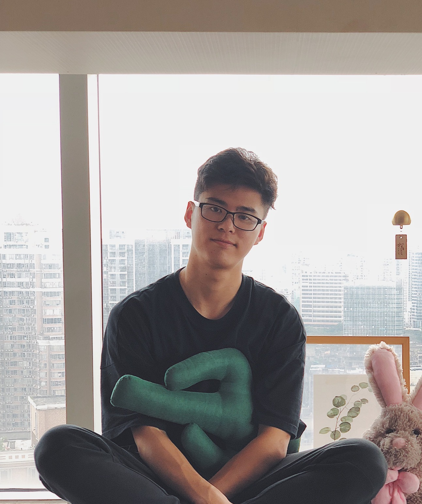

We are a team based in the [School of Computing, National University of Singapore](http://www.comp.nus.edu.sg).

You can reach us at the email `cs2103w144@gmail.com`

## Project team

### Chan Qin Liang

[[github](https://github.com/qlchan24)]
[[portfolio](team/qlchan24.md)]

* Role: Review Manager
* Responsibilities: Code quality, review deliverables, release management

### Jeffrey Tan Jian Sheng

[[github](http://github.com/jeffreytjs)]
[[portfolio](team/jeffreytjs.md)]

* Role: Developer, Draft manager
* Responsibilities:
    * In charge of Documentation maintenance inclduding:
      * User stories
      * User guide
      * Developer guide
    * Product Demo
    * UI Design

### Lim Zheng Wei

[[github](http://github.com/zhengweii)] [[portfolio](team/zhengweii.md)]

* Role: Git/GitHub & Code Manager
* Responsibilities: Providing assistance for Git,
ensuring coding standards as well as managing the GitHub repo e.g.
checking on LoC contributions and milestones management

### Toh Yu Ting

[[github](https://github.com/tohyuting)]
[[portfolio](team/tohyuting.md)]

* Role: Minute manager/Assistant draft manager
* Responsibilities: Record minutes during meeting and manage collaborative documentations for project discussions.
  Work closely with draft manager to manage and update the user stories, user guide, UML diagram, developer guide.
  Update user and developer guides that are not specific to a feature.

### Wang Zhenlin

[[github](http://github.com/Criss-Wang)]
[[portfolio](team/criss-wang.md)]

* Role: Communication/progress manager; Tech Helper;
* Responsibilities:
    * In charge of `Delete` command.
    * In charge of team communication (Setup channel/meeting schedule/deal with emergency situation).
    * Track and manage team progression.
    * Help team members with technical difficulties and catch up to the team's progress.
