## Introduction

This is the developer guide for **CLI-nic**, a brownfield project evolved from [AddressBook3](https://github.com/nus-cs2103-AY2021S1/tp).

CLI-nic is a desktop application to help medical supply managers keep track of medical products and storage.
It is optimized for usage via typing of commands, while the suppliers/warehouses and their associated
product information is shown on our Graphical User Interface (GUI). CLI-nic can be used to store and
retrieve information much faster than traditional GUI apps if you can type fast.

If you are interested in developing CLI-nic, this Developer Guide will introduce to you the architecture
and help you gain an overview of the implementation of the various features and components. You may use the
table of contents below to navigate easily to sections within this document.

## Table of Contents
* Table of Contents
{:toc}

--------------------------------------------------------------------------------------------------------------------

## **Setting up, getting started**

Refer to the guide [_Setting up and getting started_](SettingUp.md).

--------------------------------------------------------------------------------------------------------------------

## **Design**

### Architecture

The ***Architecture Diagram*** given above explains the high-level design of the App. Given below is a quick overview of each component.

:bulb: **Tip:** The `.puml` files used to create diagrams in this document can be found in the [_diagrams_](https://github.com/AY2021S1-CS2103-W14-4/tp/tree/master/docs/diagrams/) folder. Refer to the [_PlantUML Tutorial_ at se-edu/guides](https://se-education.org/guides/tutorials/plantUml.html) to learn how to create and edit diagrams.

**`Main`** has two classes called [`Main`](https://github.com/AY2021S1-CS2103-W14-4/tp/tree/master/src/main/java/seedu/clinic/Main.java) and [`MainApp`](https://github.com/AY2021S1-CS2103-W14-4/tp/tree/master/src/main/java/seedu/clinic/MainApp.java). It is responsible for,
* At app launch: Initializes the components in the correct sequence and connects them up with each other.
* At shut down: Shuts down the components and invokes cleanup methods where necessary.

[**`Commons`**](#common-classes) represents a collection of classes used by multiple other components.

The rest of the App consists of four components.

* [**`UI`**](#ui-component): The UI of the App.
* [**`Logic`**](#logic-component): The command executor.
* [**`Model`**](#model-component): Holds the data of the App in memory.
* [**`Storage`**](#storage-component): Reads data from, and writes data to, the hard disk.

Each of the four components,

* defines its *API* in an `interface` with the same name as the Component.
* exposes its functionality using a concrete `{Component Name}Manager` class (which implements the corresponding API `interface` mentioned in the previous point.

For example, the `Logic` component (see the class diagram given below) defines its API in the `Logic.java` interface and exposes its functionality using the `LogicManager.java` class which implements the `Logic` interface.

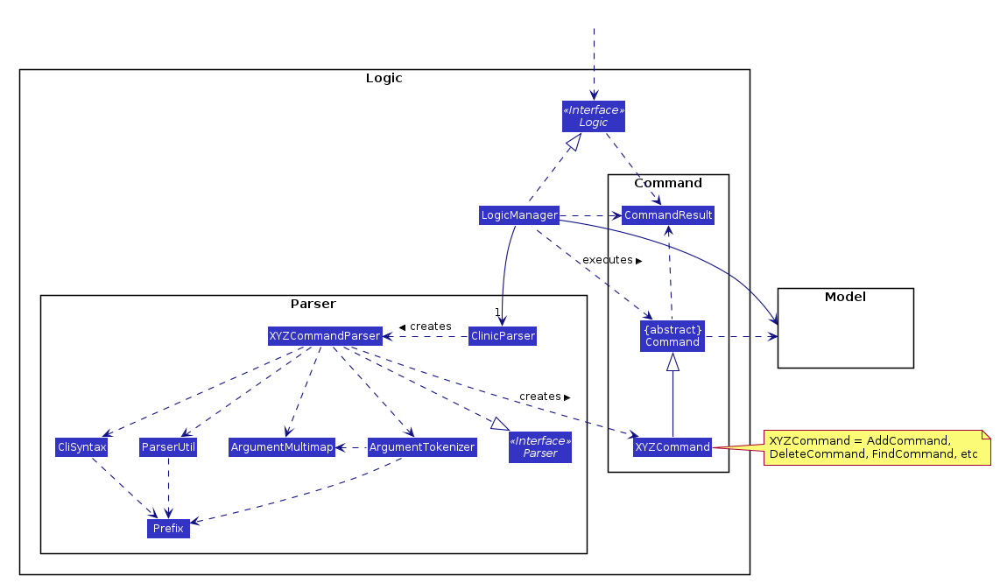

**How the architecture components interact with each other**

The *Sequence Diagram* below shows how the components interact with each other for the scenario where the
 user issues the command `delete ct/s i/12`.

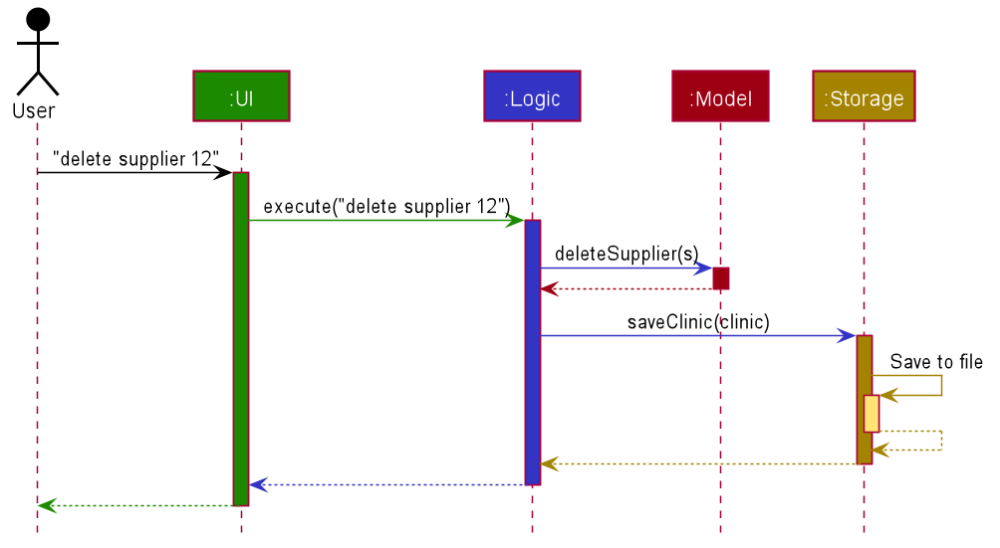

The sections below give more details of each component.

### UI component

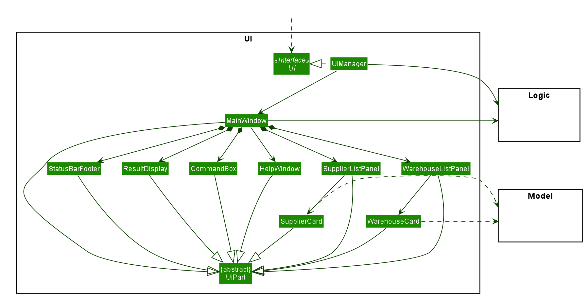

**API** :
[`Ui.java`](https://github.com/AY2021S1-CS2103-W14-4/tp/tree/master/src/main/java/seedu/clinic/ui/Ui.java)

The UI consists of a `MainWindow` that is made up of parts e.g. `CommandBox`, `ResultDisplay`, `SupplierListPanel`, `WarehouseListPanel`, `StatusBarFooter` etc. All these, including the `MainWindow`, inherit from the abstract `UiPart` class.

The `UI` component uses JavaFx UI framework. The layout of these UI parts is defined in matching `.fxml
` files that are in the `src/main/resources/view` folder. For example, the layout of the [`MainWindow`](https://github.com/AY2021S1-CS2103-W14-4/tp/tree/master/src/main/java/seedu/clinic/ui/MainWindow.java) is
 specified in [`MainWindow.fxml`](https://github.com/AY2021S1-CS2103-W14-4/tp/tree/master/src/main/resources/view/MainWindow.fxml)

The `UI` component,

* Executes user commands using the `Logic` component.
* Listens for changes to `Model` data so that the UI can be updated with the modified data.

### Logic component

**API** :
[`Logic.java`](https://github.com/AY2021S1-CS2103-W14-4/tp/tree/master/src/main/java/seedu/clinic/logic/Logic.java)

1. `Logic` uses the `MacroParser` class to parse the user input.
1. The resultant command string is returned to the `LogicManager` and then parsed by the `ClinicParser`.
1. This results in a `Command` object which is executed by the `LogicManager`.
1. The command execution can affect the `Model` (e.g. adding a supplier).
1. The result of the command execution is encapsulated as a `CommandResult` object which is passed back to the `Ui`.
1. In addition, the `CommandResult` object can also instruct the `Ui` to perform certain actions, such as displaying help to the user.

Given below is the Sequence Diagram for interactions within the `Logic` component for the `execute("ds i/12")` API call, where there is a saved macro with the alias `ds` for the command string `delete ct/s`.

:information_source: **Note:** The lifeline for `DeleteCommandParser` should end at the destroy marker (X) but due to a limitation of PlantUML, the lifeline reaches the end of diagram.

### Model component

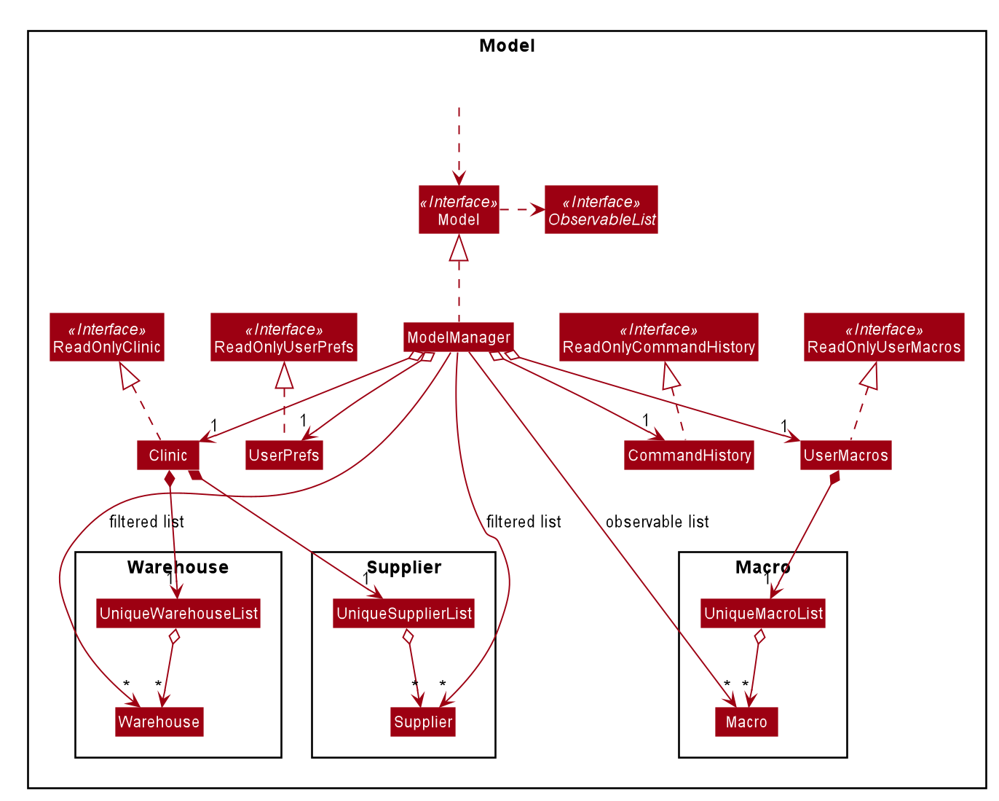

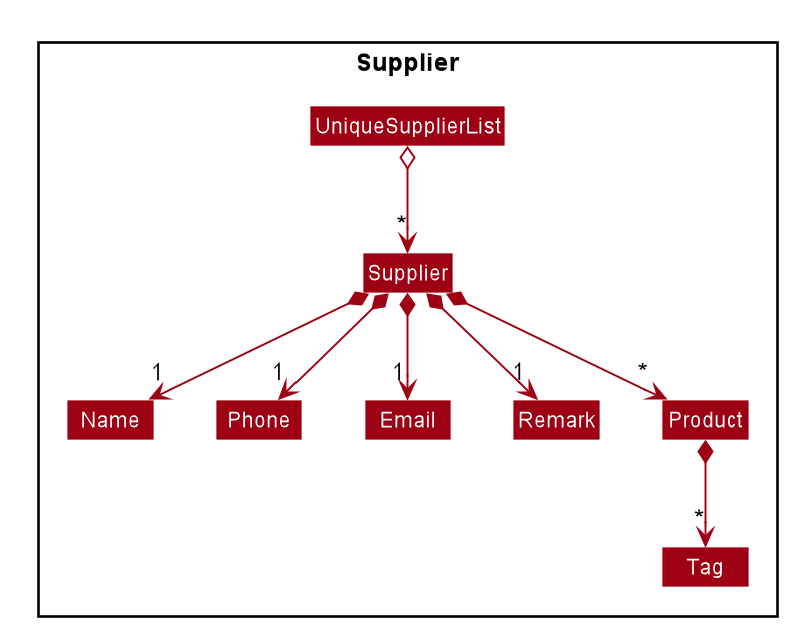

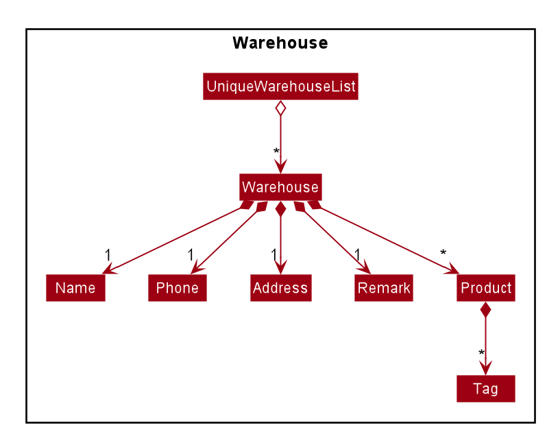

**API** : [`Model.java`](https://github.com/AY2021S1-CS2103-W14-4/tp/blob/master/src/main/java/seedu/clinic/model/Model.java)

The `Model`,

* stores a `UserPref` object that represents the user’s preferences.
* stores the CLI-nic data.
* exposes an unmodifiable `ObservableList<Supplier>`, `ObservableList<Warehouse>` and `ObservableList<Macro>` that can be 'observed' e.g. the UI can be bound to these lists so that the UI automatically updates when the data in the lists change.
* does not depend on any of the other three components.

:information_source: **Note:** An alternative (arguably, a
 more OOP) model for `Clinic` is given below. 
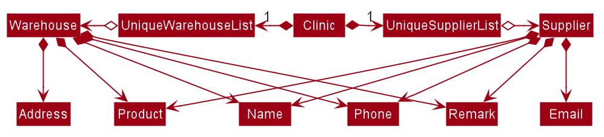

### Storage component

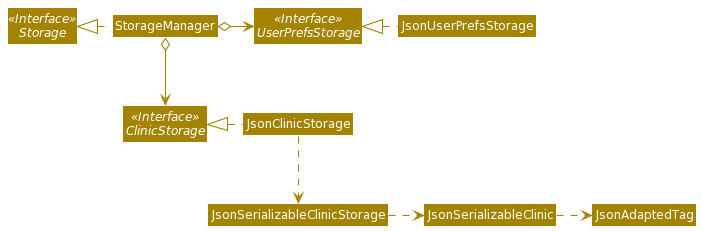

**API** : [`Storage.java`](https://github.com/AY2021S1-CS2103-W14-4/tp/blob/master/src/main/java/seedu/clinic/storage/Storage.java)

The `Storage` component,
* can save `UserPref` objects in json format and read it back.
* can save `UserMacros` objects in json format and read it back.
* can save `CommandHistory` objects in txt format and read it back.
* can save the CLI-nic data in json format and read it back.

### Common classes

Classes used by multiple components are in the `seedu.clinic.commons` package.

--------------------------------------------------------------------------------------------------------------------

## **Implementation**

This section describes some noteworthy details on how certain features are implemented. Note that the examples given to explain each feature uses full command strings instead of macros so as to show the true format of each command.
Similarly, `MacroParser` has been omitted from the diagrams to reduce clutter. Refer to the [Logic Component](#logic-component) to read how a command would be executed with macros.

### Add feature

The `add` feature will be elaborated in this section by its functionality and path execution with the aid of
Class, Activity, and Sequence Diagrams. It is facilitated by the `AddCommandParser` and the `AddCommand` where
`AddCommandParser` implements `Parser` and the `AddCommand` extends `Command`. These allow the user to
add a supplier/warehouse to the app using the command line.

The following Class Diagram of `AddCommand` shows the interactions between `AddCommand` and other classes
in CLI-nic:

:information_source: **Note:** Only important
associations are displayed.

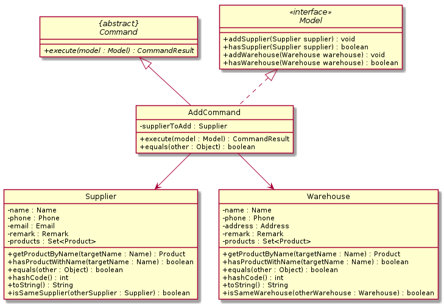

#### What Add feature does

The `add` feature allows user to add information for a supplier/warehouse.

A supplier's attributes consist of `name`, `phone` and `email` while a warehouse's attributes consist of
`name`, `phone` and `address`.

The supplier/warehouse can also consist of an optional `remark` attribute.

:information_source: **Note:** The `add` feature does not
include product information and the `update` feature should be used to associate a supplier/warehouse with a
product and its associated quantity and tags. This is elaborated in the [**`Update`**](#update-product-feature) feature section.

#### Path Execution of Add Command
The workflow of an `add` command when executed by a user is shown in the Activity Diagram below:

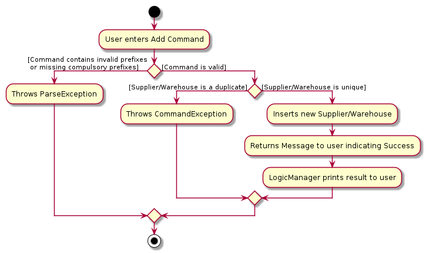

Important features of the Activity Diagram are as follows:

1. The `add` command only allows addition of a single supplier/warehouse for every single command. If two
 or more `ct/COMMAND_TYPE` are provided, the last type specified will be used to process the user's input.
 This applies for all other prefixes as well.

1. After the user calls the `add` command, the code will check for the presence of all the compulsory
 prefixes (i.e. `ct/COMMAND_TYPE`, `n/NAME`, `p/PHONE` and `e/EMAIL` or `addr/ADDRESS` for supplier and warehouse
 respectively) in the input. A `ParseException` will be thrown if any of the compulsory prefixes are not
 present.

   Similarly, `ParseException` will be thrown if there are any invalid prefixes or inappropriate fields
   provided (e.g. input a `String` value for `phone`).

1. `AddCommand` will then be executed. The new supplier/warehouse will be added in the `Model`, allowing
 users to see the added supplier/warehouse.

    If new supplier/warehouse to be added has a duplicate name (i.e. the supplier/warehouse name already
    exist in CLI-nic), it will throw a `CommandException`. Otherwise, a success message will be displayed
    to the user.

In the following section, the interaction between different objects when a user executes an `add` command
will be discussed with the aid of a Sequence Diagram as shown below.

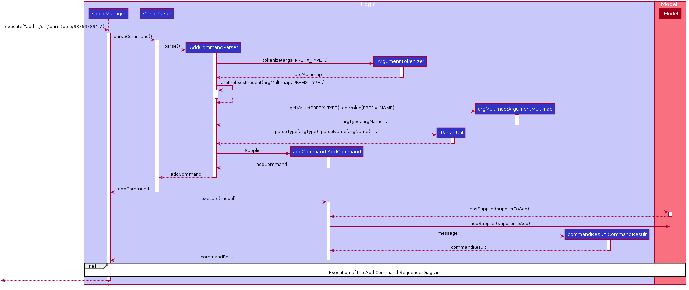

:information_source: **Note:** The lifeline for
`AddCommandParser` should end at the destroy marker (X) but due to a limitation of  PlantUML, the lifeline
reaches the end of diagram.

1. Parsing

    After receiving an input from user for `add` command, `AddCommandParser#parse` will be invoked to tokenize
    the arguments parsed in via `ArgumentTokenizer#tokenize`.

    As mentioned above, if any of the compulsory prefixes are not present, `AddCommandParser` will throw a new
    `ParseException` object to the `LogicManager`. A `ParseException` will also be thrown if there are invalid
    prefixes or values provided (e.g. input a `z/` or `String` value for `phone`).

    Subsequently, parsing of general details will occur for both Supplier and Warehouse type. These include
    parsing of `name`, `phone` and `remark`. In addition, since Supplier contains an `email` attribute, parsing
    of this field will be carried out. On the other hand, parsing of `address` will be carried out for
    Warehouse instead.

    At the end, relevant fields present will be set in `Supplier`/`Warehouse`.

    During this parsing process, `ParseException` will be thrown if any of the inputs are invalid.

1. Execution

    `Model#hasSupplier`/`Model#hasWarehouse` will then be executed to check for duplicates (i.e. if
    `Model` already contains a supplier or warehouse with the same name), a CommandException will be
    thrown to inform user of the duplicated supplier/warehouse. Otherwise, the supplier/warehouse will be
    successfully added via `Model#addSupplier`/`Model#addWarehouse`.

1. Result display

    `Model` will be updated to reflect the added supplier or warehouse in GUI and an add success message will be
     displayed to user.

### Assign macro feature

#### What the assign macro feature does

The assign macro feature allows users to be able to create their own alias for a specific command string which can be used to enter commands after the macro is saved.

#### How it is implemented

The assign macro mechanism is facilitated by 2 components: `AssignMacroCommandParser` and `AssignMacroCommand`.
`AssignMacroCommandParser`'s job is to parse the user input to generate the correct `Alias` and `SavedCommandString`  objects for the `AssignMacroCommand`.
`AssignMacroCommand`'s job is to execute the main logic for updating the model with the new macro.

Given below is an example usage scenario, together with a sequence diagram, to show how the assign macro mechanism behaves at each step.
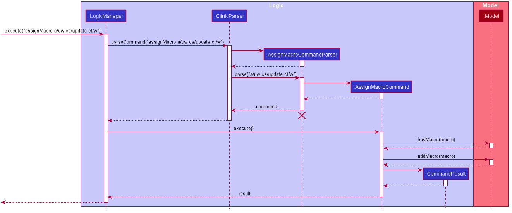

The user frequently updates the products under each warehouse and decides to create a new macro with the alias "uw" for the command string "update ct/w" so as to shorten subsequent command inputs.
The user does this by executing the `assignmacro a/uw cs/update ct/w` command.

1. Parsing

   The input string will be passed to the `AssignMacroCommandParser`. By matching the prefixes provided, `AssignMacroCommandParser#parse` then attempts to create a new instances of `Alias` and `SavedCommandString` after matching the prefixes, and throws
an exception to be displayed on the GUI if the alias or command string supplied by the user is invalid, or if any of them is not supplied at all. If all prefixes are parsed without error,
a `Macro` is created from the `Alias` and `SavedCommandString` instances. Then, a new `AssignMacroCommand` instance is created with the new `Macro`.

1. Execution

   The `AssignMacroCommand#execute` method will then be called with the `model` instance. The method will first check if there is any existing macro in the model that uses the same alias.
If that is true, an exception will be thrown. This will be shown on the GUI as an error message. Otherwise, the new macro will be added to the model.

1. Result display

   The `AssignMacroCommand#execute` then passes a `CommandResult` with a success message back to the `LogicManager`. Finally, the model is saved and the GUI is updated with the success message.
The user now updates the quantity of the product "Panadol" in the aforementioned warehouse by simply executing the command `uwm pd/Panadol`.

The following activity diagram summarizes what happens when a user assigns a macro:
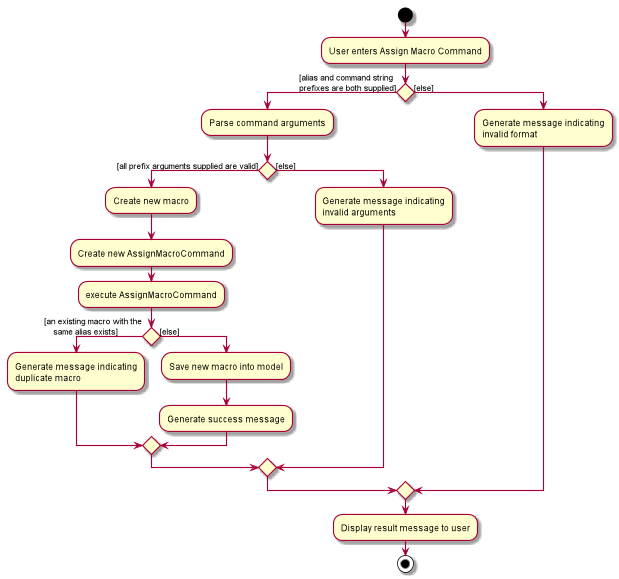

#### Why it is implemented this way

The main consideration for this feature was what macros should the users be allowed to store, if not everything. We wanted the command to be non-restrictive,
yet still include certain checks to prevent misuse. Hence we decided to throw exceptions for certain types of macros that the user may try to define. In particular, exceptions will be thrown to prevent
assigning a macro with the same alias as a pre-defined command word, so that fundamental commands will not be
overwritten by users. Apart from that, we decided not to allow saved command strings that do not start with a pre-defined command word, as the macros created from these command strings will never
work as they will always give invalid commands. Nonetheless, we decided to allow partial command strings and even full command strings that may not be valid commands as long as they fit the above criteria,
as these macros can be used with additional arguments supplied (possibly making the command valid), or that the command string may be valid upon certain conditions (e.g. after the user adds a supplier).
However, this also means that a valid macro does not guarantee a successful command when used, and error messages may still be displayed for the underlying command of the macro if the underlying command is invalid during the actual use of the macro.

### Auto-complete feature

In this section, the functionality of the auto-complete feature will be discussed together with the expected
interface.

#### What is the Auto-complete feature

The auto-complete feature is to help users complete their commands faster through the suggestions of
commands with their corresponding compulsory prefixes based on user input.

#### How it is implemented

All possible commands and their compulsory prefixes are saved in a SortedSet.

When a user types a command on the text box, `AutoCompleteTextField#populatePopup` will be called where the
user’s input will be matched against the set.

If the case of a match, a contextMenu showing all possible auto-complete commands will show up.

This method is implemented such that the results in the contextMenu are constantly updated as the user is
typing and this would make it more intuitive for users.

#### Why it is implemented this way

The auto-complete feature is implemented this way to reduce the need for space on the GUI by only showing
up when there is a potential match. It would also serve to value add to the user experience by speeding up
the process of typing the full command and reduce mistakes by including all the compulsory prefixes.

#### How Auto-complete works

User wishes to enter an `add` command to add a supplier via `add ct/s n/John p/91234567 e/john@example.com
 r/friend`.

Upon typing "a", the auto-complete context menu will pop up showing the possible auto-completed commands
, mainly:

* add ct/s n/ p/ e/ r/

* add ct/w n/ p/ addr/ r/

* assignmacro a/ cs/

Upon seeing this, the user will be able to select from those options or use them as a guide to complete
his/her commands more intuitively.

#### Design consideration

When the full command for single-worded commands are typed in the commandBox, the
AutoCompleteTextField#popUpEntries would be hidden to achieve smoother navigation for users when
accessing commandHistory.

### Command history feature

In this section, the functionality of the command history feature will be discussed.

#### What is the command history feature

The command history feature helps user to recall, edit and to reuse long or complicated commands with ease
without having to retype them.

#### How it is implemented

1. When the user starts CLI-nic, a `CommandHistory` model will be initialised to store all the previous command history
entered which is saved in the commandHistory.txt file. Reading from commandHistory.txt is only done once at the start.

1. If the commandHistory.txt file does not exist, the `CommandHistory` model will be initialised with an empty
`CommandHistoryList` which is encapsulated inside `CommandHistory`.

1. When a user enters a valid command, the `execute` method of `LogicManager` will be called and this saves the valid
command entered by the user to the commandHistory.txt file. At the same time, the command will also be added to the
`CommandHistoryList` such that users are able to access the latest history. Since we do not read again from the
commandHistory.txt file, it is necessary to update the in-memory `CommandHistoryList`.

#### Why it is implemented this way

The command history feature is implemented this way to reduce the need for repeated readings from commandHistory.txt
whenever a new valid command is entered by the user. As the commandHistory.txt file gets longer, reading repeatedly
from it can result in a significant reduction in performance.

### Delete feature

The `delete` feature will be elaborated in this section by its functionality, the path execution with the aid of a sequence and an activity diagram.
The details of `DeleteCommand`'s class implementation and its interactions with associated objects will also be discussed.

#### What Delete feature does

The `delete` feature allows user to remove a warehouse or supplier __(case 1)__.
 
The `delete` feature also allows user to remove a product from a certain warehouse or supplier __(case 2)__.
 
 
In case 1, `TYPE` needs to be set to `w` or `s`.
 
In case 2, `TYPE` needs to be set to `pw` or `ps`, and a `PRODUCT_NAME` needs to be specified.
 
 
The deletion is limited to the items shown in the list displayed in GUI, and is done one item at a time.

#### Path Execution of Delete Command

The workflow of a `DeleteCommand` when executed by a user is shown in the activity diagram below:

 

With reference to the activity diagram above, the user input will be sent to `DeleteCommandParser` for parsing.
The `DeleteCommandParser` will check if the compulsory prefixes are present (i.e. `ct/TYPE` and `i/INDEX`) and the corresponding
argument values are all valid.
A `ParseException` will be thrown if the check fails.

If the `TYPE` parsed indicates a product deletion (via `ct/ps` or `ct/pw`), an additional field `PRODUCT_NAME` is parsed with its prefix and value checked.

Next, a new `DeleteCommand` will be generated and executed. There are four possible paths for the `delete` command:

1. The target to delete is a `supplier`/`warehouse`  
CLI-nic finds the target `supplier`/`warehouse` at the specified `INDEX` of the displayed list and remove it completely.

1. The `INDEX` specified is invalid (e.g. exceeds the length of the list)  
A `CommandException` error message will be thrown.

1. The target to delete is a `product` in a particular `supplier`  
CLI-nic finds the target `supplier` at the specified `INDEX` of the displayed supplier list, and retrieve its product list. 
It finds the `product` with specified `PRODUCT_NAME` and remove it from the product list.

1. No `product` has the `PRODUCT_NAME` in the target warehouse/supplier  
A `CommandException` error message will be thrown.

#### Structure of Delete command

We demonstrate the structure of the `delete` feature implementation below.

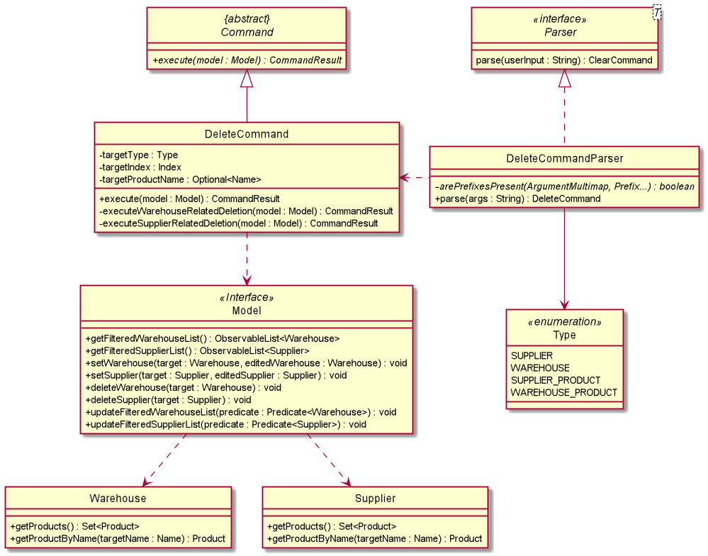
 

Note that some commonly applied methods (such as getter/setter methods for each attribute) are not included to reduce verbosity.

#### Delete Command's interaction with related objects

In the following section, the interaction between Delete Command and its associated objects in the delete feature will be discussed.
The sequence diagrams below demonstrate the workflow in the deletion feature.

##### Deletion of a supplier/warehouse

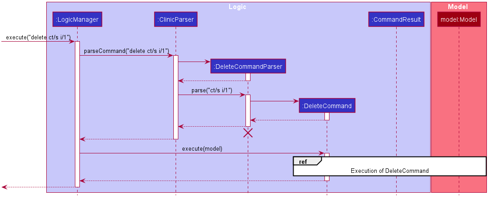
 

1. Parsing  

    CLI-nic's `ClinicParser` will parse the user input and if the `delete` command word is present, the parser will try to parse the
    input to generate a valid `DeleteCommand` via `DeleteCommandParser`.  

    Checks for compulsory prefixes and valid arguments (`ct/TYPE` and `i/INDEX` in this case) are done. The code will throw a `ParseException` if the check fails. 

    If multiple entries of `ct/TYPE` or `i/INDEX` are found, the last entry will be used as the argument.  

    Afterwards, all the valid arguments (`INDEX` and `TYPE`) will create a new `DeleteCommand`, which will be executed.

1. Execution  

    The `DeleteCommand` is executed via a `execute` call from `LogicManager`.
    The workflow for an execution of `DeleteCommand` is as shown in the Sequence Diagram below: 

    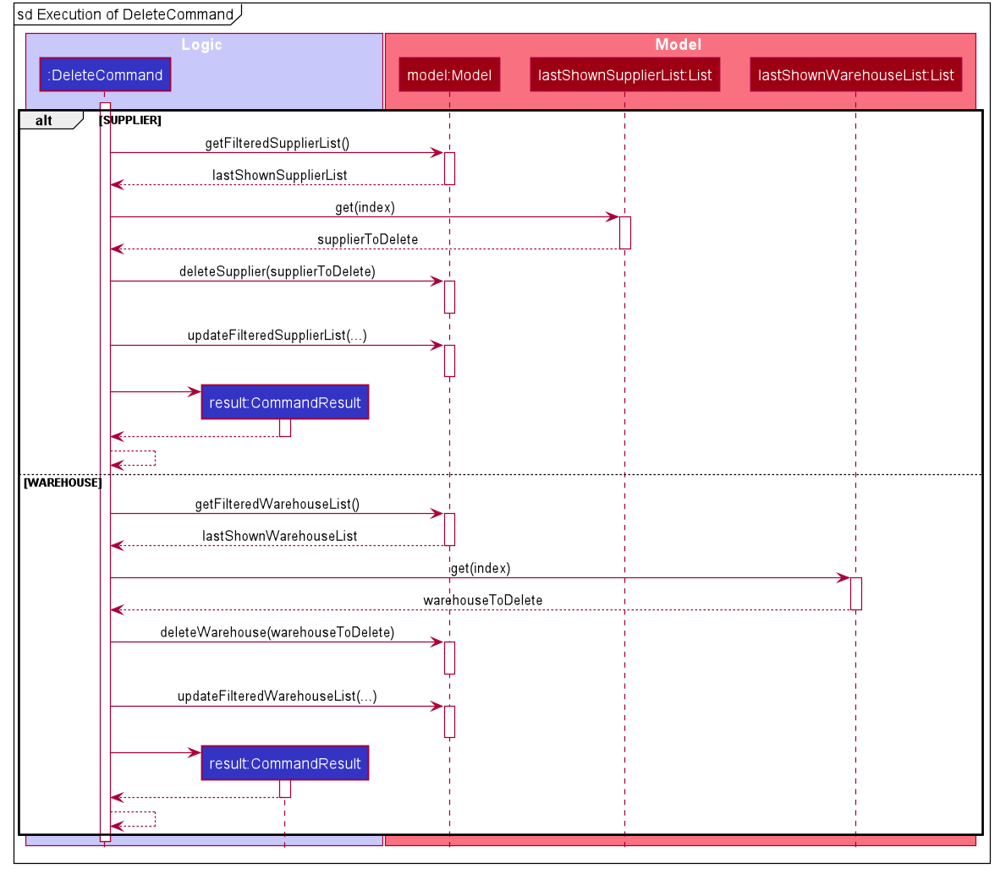  

    Using the `targetType` attribute, the execution is first classified as either Supplier deletion (`s`) or Warehouse deletion (`w`).  

        Base on the classification, the model will retrieve the relevant displayed list of warehouse/supplier via `model#getFilteredWarehouseList()`/`model#getFilteredSupplierList()`.  

    It then locates the warehouse/supplier entry that user wants to delete via the `INDEX` passed in.

    Afterwards, `model#deleteWarehouse`/`model#deleteSupplier` will remove the target entry from the list in the `model`. The `model` will then update the displayed list.

1. Result display  

    With the deletion completed, the Model will update the filtered lists of `Supplier` and `Warehouse` to be displayed in the UI.
    A `CommandResult` will be returned to the `LogicManager` with a success message, which will be shown to the user in the UI.

##### Deletion of a product

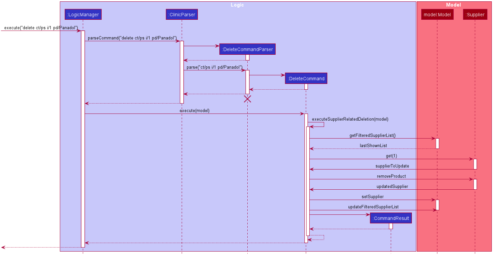
 

1. Parsing

    The parsing workflow is the same except that now an additional field `pd/PRODUCT_NAME` will be checked (with both prefix and argument) and parsed.  

    Afterwards, all the valid arguments (`INDEX`, `TYPE` and `PRODUCT_NAME`) will create a new `DeleteCommand`, which will be executed.

1. Execution

    The `DeleteCommand` is executed via an `execute` call from `LogicManager`.
    The workflow for an execution of `DeleteCommand` is as shown in the Sequence Diagram below: 

    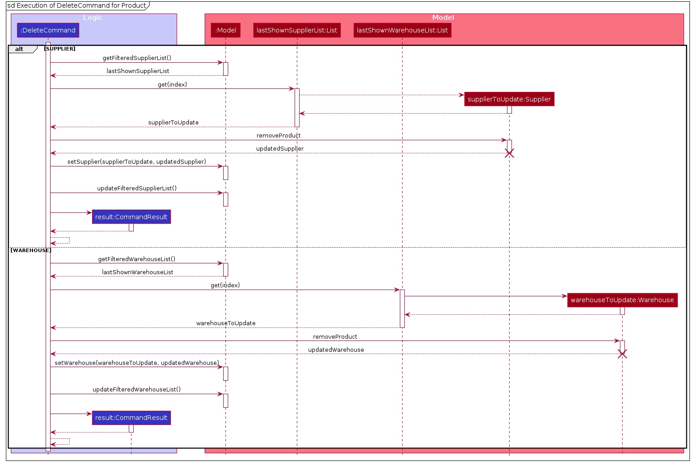  

    Using the `targetType` attribute, the execution is now classified as either Supplier-related product deletion (`ps`) or Warehouse-related product deletion (`pw`).  

    Based on the classification, the model will again retrieve the relevant displayed list of warehouse/supplier via `model#getFilteredWarehouseList()` / `model#getFilteredSupplierList()`.

    It then locates the respective warehouse/supplier entry at the `INDEX` passed. A product in this entry is to be deleted.

    Next, the product matching the required `PRODUCT_NAME` will be retrieved via `getProductByName`, and an updated target entry with this product removed will be returned through `removeProduct` call.

    Afterwards, `model#setWarehouse`/`model#setSupplier` will replace the old entry with the updated target entry from the list in the `model`. The `model` will then update the displayed list.

1. Result display  

    With the deletion completed, the Model will update the filtered lists of `Supplier` and `Warehouse` to be displayed in the UI.
    A `CommandResult` will be returned to the `LogicManager` with a success message, which will be shown to the user in the UI.

### Edit feature
The `edit` feature will be elaborated in this section by its functionality and path execution with the aid of Class, Sequence and an Activity Diagrams.

The Class Diagram of `EditCommand` shows the interactions between EditCommand and other classes in CLI-nic.

Only important associations are displayed in class diagram below:

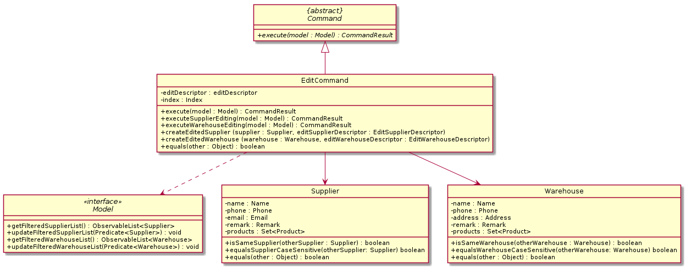

#### What Edit feature does
The edit feature allows user to edit a supplier/warehouse information. This include `name`, `phone`, `remark`, a supplier's `email` and a warehouse's `address`.

This is important as warehouses and suppliers might change their contact details from time to time, and the user has to be able to edit this information quickly.

One thing to note is edit feature does not allow users to edit any `product` associated with a particular supplier or warehouse. To edit the product quantity or tag of a product, `update` feature should be used instead. This is elaborated in the [**`Update`**](#update-product-feature) feature section.

#### Path Execution of Edit Command
The workflow of an `edit` command when executed by a user is shown in the activity diagram below:

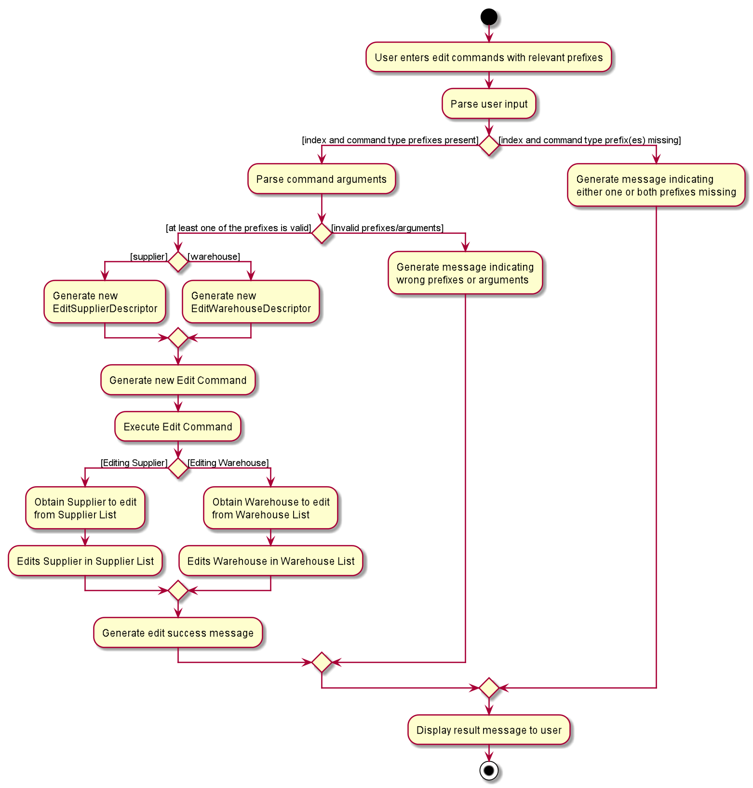

Important features of the Activity Diagram are as follows:

1. The `edit` command only allows editing of a single warehouse or supplier for every single command. If two or more `ct/COMMAND_TYPE` are provided, the last type specified will be used to process user's input. This also applies for other prefixes.

1. If the compulsory prefixes (i.e. `ct/COMMAND_TYPE` and `i/INDEX`) are not present, `ParseException` will be thrown.

   Similarly, `ParseException` will be thrown if no field for editing of suppliers or warehouses is provided. This also applies if there are any inappropriate fields supplied (e.g. `i/test` or `p/test`).

1. `EditCommand` will then be executed. The edited supplier or warehouse will be updated in the model, allowing users to see the changes done for the respective supplier or warehouse.

   If the edited fields result in no changes to the existing supplier or warehouse, a `CommandException` will be thrown to remind user that the supplier or warehouse will be unchanged.

In the following section, the interaction between different objects will be discussed with the aid of a Sequence Diagram to understand the workflow when a user executes an `edit` command.

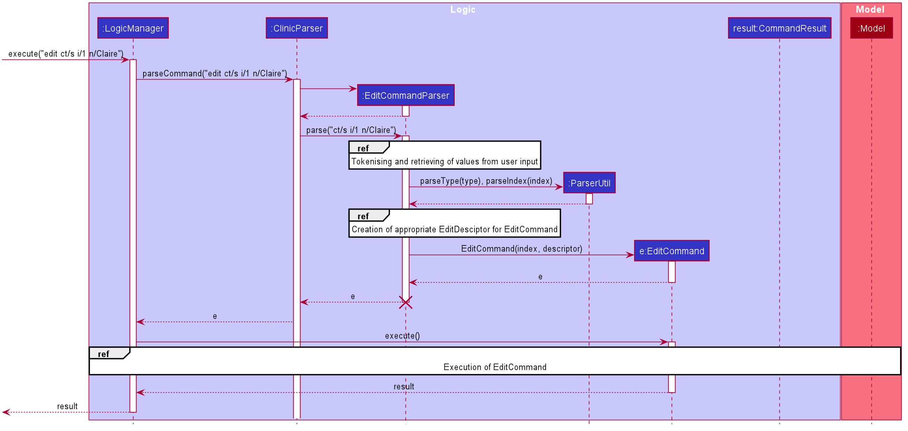

1. Parsing

   After receiving an input from user for edit command, `EditCommandParser#parse` will be invoked.

   As mentioned in above section, if either one of the compulsory prefixes is missing, `ParseException` will be thrown to remind users. Furthermore, invalid values supplied for `type` and `index` (e.g. `i/test`), a `ParseException` will be thrown.

   An attempt to determine the correct type and creating the relevant `EditDescriptor` will then be carried out. During this process, if incorrect prefixes such as an `email` prefix for warehouse or an `address` prefix for supplier was found, a `ParseException` will be thrown.

   It should be noted that both `EditSupplierDescriptor` and `EditWarehouseDescriptor` are subclasses of `EditDescriptor`. All three classes are inner classes of `EditCommand`. Despite being inner classes, they work as crucial helper classes for `EditCommand` to execute `edit` feature smoothly.

   This inheritance relationship is shown below:

   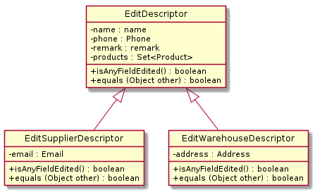

   The logical workflow of creating an appropriate `editDescriptor` is shown in the sequence diagram below:

   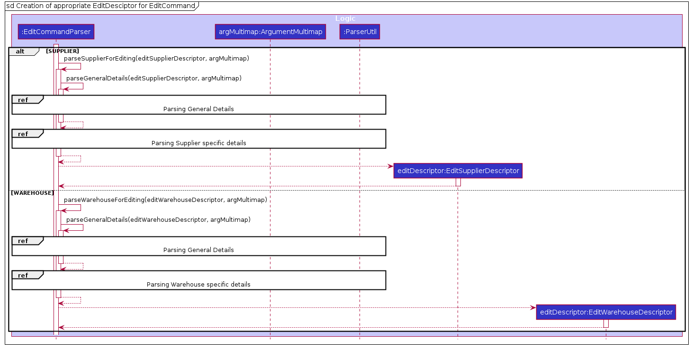

   Parsing of general details will occur for both Supplier and Warehouse type. These include parsing of `Name`, `Phone` and `Remark`.

   In addition, since Supplier contains an `Email` attribute, parsing of this field will be carried out. On the other hand, parsing of `Address` will be carried out for Warehouse instead.

   At the end, relevant fields present will be set in `editDescriptor`.

   During this parsing process, `ParseException` will be thrown if any of the inputs are invalid.

1. Execution

   EditCommand will be executed and the workflow is shown in the Sequence Diagram below:

   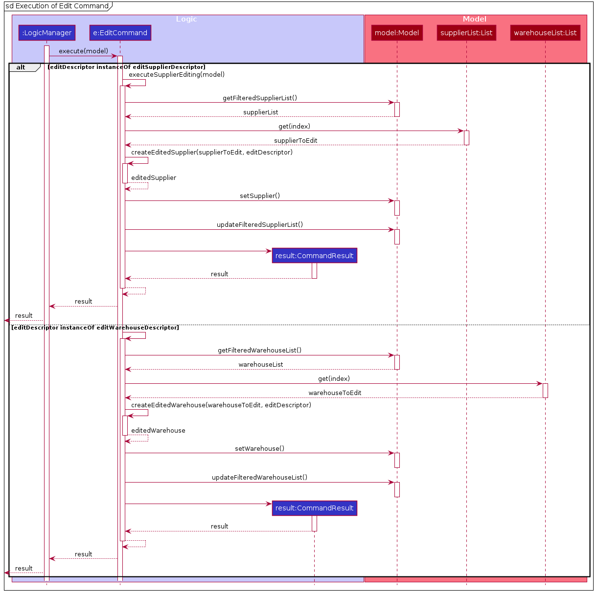

   The list of suppliers or warehouses currently shown to user is first obtained from `Model` for retrieval of appropriate entity.

   An entity with edited properties is created with `EditCommand#createEditedSupplier` or `EditCommand#createEditedWarehouse`.

   If `Model` already contains a supplier or warehouse with the same name, a `CommandException` will be thrown to inform user of the duplicated supplier or warehouse.

   Similarly, a `CommandException` will be thrown if input result in same supplier or warehouse (i.e. supplier or warehouse information unchanged).

1. Result display

   `Model` will be updated to reflect the edited supplier or warehouse in GUI and an edit success message will be displayed to user.

#### Why Edit feature is implemented this way
The `edit` command is implemented this way to ensure consistency with the other commands in the application. This helps to minimise any potential confusion for the users.

In addition, it was intended for `EditCommand` to throw out a `CommandException` when none of the field changes an existing entry. This serves as a reminder for users in case they made a minor mistake in their command.

Besides, a command type prefix, `ct/COMMAND_TYPE` is required in the implementation of `edit` command to indicate whether user wishes to edit a warehouse or supplier entry.

Without this, an alternative would be for a `TYPE` parameter, where user have to indicate `supplier` or `warehouse`. However, this may not be suitable for our target user, who wishes to update information quickly.

Lastly, another alternative considered was to create separate commands for warehouses and suppliers respectively.

For example, `editw` and `edits` to represent edit warehouse and edit supplier. However, this might increase duplicated codes, since minimal changes to the code would be found for each class of command.

Therefore, our team decided to implement `edit` command by taking in prefixes and throwing our relevant exceptions at appropriate points after considering code quality and end user experience.

### Find feature

#### What Find feature does
The find feature allows users to find all relevant suppliers or warehouses by their names, by their remarks and/or by
names of the products sold/stored. Users are able to search for relevant suppliers or warehouses using either only one
or a combination of these criteria. Note that users are only able to search for either suppliers or
warehouses at any one time and not both at the same time.

#### How it is implemented
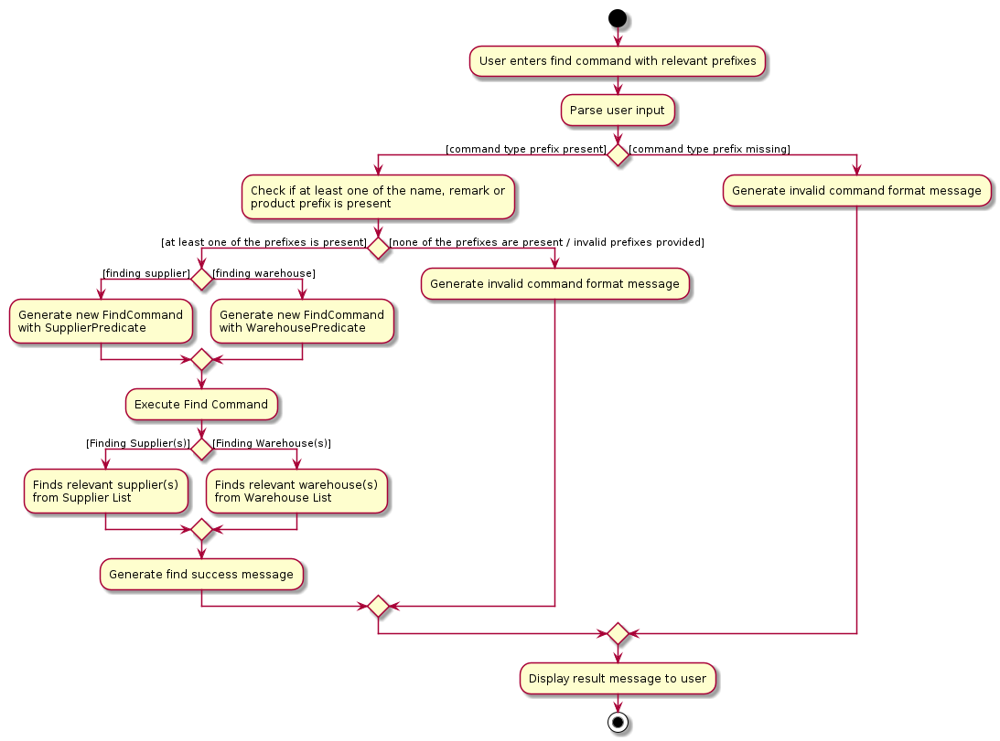

1. After the `find` command is called with the relevant prefixes, the user input will be sent
to `FindCommandParser` for parsing.

1. `FindCommandParser` will then check if the compulsory prefix `ct/COMMAND_TYPE` is present. If the user enters
`ct/COMMAND_TYPE` prefix more than once, only the last prefix specified will be used to process user's input. If the
prefix `ct/COMMAND_TYPE` is not present, a `ParseException` will be thrown and an invalid command format message
will be shown to the user.

1. If command type prefix is present, `FindCommandParser` will then proceed to check for the existence of at least
one of the following prefixes `n/NAME`, `r/REMARK` and `pd/PRODUCT`. If none is found or invalid prefixes are provided,
a `ParseException` will be thrown and an invalid command format message will be shown.

1. Once the user has entered the correct format, `FindCommandParser` will create a new `FindCommand` with either a
`SupplierPredicate` or `WarehousePredicate`. This `FindCommand` will then be executed and the relevant supplier(s)
or warehouse(s) will be filtered out.

1. The model will then display the relevant supplier(s) or warehouse(s) to the user via the method
`model#getFilteredSupplierList()` or `model#getFilteredWarehouseList()`.

#### Why it is implemented this way
The `find` command is implemented this way to ensure consistency with the other commands in the application regarding
the prefixes. This helps to minimise any potential confusion for the users by standardising the prefixes that `find`
command takes in with the other relevant commands. In addition, a command type prefix, `ct/COMMAND_TYPE` is required in the
implementation of `find` command to indicate whether the user wishes to search for suppliers or warehouses. Without this
prefix, the application will not be able to know if the user wishes to search for suppliers or warehouse.

#### Alternatives considered
In our previous implementation, we did not require the user to enter the command type prefix. Instead, we only required
the user to enter the `TYPE` parameter in the form of either `supplier` or `warehouse`. However, typing the whole word
out may not have been suitable for our target user, who wishes to find suppliers or warehouses quickly. Hence, our team
decided to use a command type prefix in place of a `TYPE` parameter, which is shorter and easier to type.

In our current implementation, users are required to enter at least one or a combination of the following prefixes:
`n/NAME`, `r/REMARK`, `pd/PRODUCT`. This allows the application to determine which criterion/criteria to filter by.
Another alternative that was previously implemented was to split the find command into three separate commands: `findn`
which allows users to search by name, `findr` which allows users to search by remarks and `findp` which allows users to
search by products. However, this implementation was deemed unsuitable as it increased code duplication with minimal
changes between the different classes. In addition, by splitting into three separate commands, users are unable to
search for suppliers or warehouses using multiple criteria. They could only search by name, by remark or by product in
any single command. By using prefixes, users are able to search for suppliers or warehouses using any combination of
name, remark and product. Taking the aforementioned points into consideration, our team has therefore decided to
implement the `find` command by taking in prefixes and throwing our relevant exceptions at appropriate points after
considering code quality and end user experience.

### Help feature
The `help` feature will be elaborated in this section by its functionality.

#### What Help feature does
`help` feature allows user to view help messages for all commands briefly or help message for specific commands. This allows user to have an over-arching idea of what they can do in **CLI-nic**. Afterwards, a user can read up about the command format and sample commands by typing in `help COMMAND`.

#### Path Execution of Help Command
An Activity Diagram showing the workflow of `help` command is shown below:

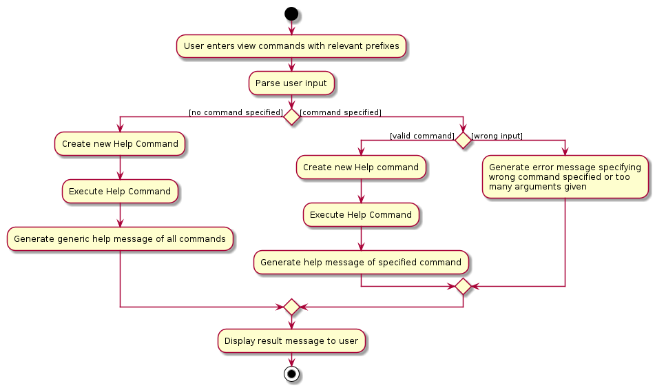

Important features of the Activity Diagram are as follows:

1. If no `COMMAND` is specified after `help`, a generic help message, consisting of all commands available in **CLI-nic** will be shown to users.

1. If more than one `COMMAND` is given, or if the `COMMAND` specified is not recognised in **CLI-nic**, a `ParseException` will be thrown to inform the user.

1. If a valid `COMMAND` is specified, the `help` message relevant to the command (includes what the command does, command format and sample commands) will be displayed to users.

#### Why Help feature is implemented this way
Instead of providing a link and asking users to read the user guide, it would be more convenient for users to access the help message for each command within the application itself. This allows user to instantly know what to key into the command box instead of switching between user guide in the browser and **CLI-nic**. In addition, this allow users to access the `help` page even without an internet connection as well.

### List Macros feature

#### What the List macros feature does

The list macros feature allows users to be able to view all presently saved macros in the application.

#### How it is implemented

The list macros feature is facilitated by the ListMacroCommand, whose job is to retrieve to list of macros and process it into a suitable format to be displayed to the user.

Given below is an example usage scenario

The user decides to check what macros he/she has saved before. The user does this by executing the `listmacro` command.

1. Parsing

   Since there are no arguments needed for this command, the `ClinicParser` directly creates the `ListMacroCommand`.

1. Execution

   `LogicManager` will then call `ListMacroCommand#execute` with the `Model` instance. `ListMacroCommand#execute` will retrieve the macro list from the `Model`.
If the list is empty, an exception is thrown which results in a message displayed on the GUI notifying the user that there are no presently saved macros.
Otherwise, the list of macros will be formatted into a readable format.

1. Result display

   The success message which contains the formatted list will be passed in a `CommandResult` to the `LogicManager`, to be displayed on the GUI without overriding the existing lists for suppliers and warehouses.

#### Why it is implemented this way

The main implementation consideration of this feature would be the display of the list. The list macros feature was implemented such that it does not use the same display section as the warehouse or supplier lists so that the user would not have to execute and additional command to restore the
supplier or warehouse lists. I decided not to include a separate display section to display the list of macros either as this feature is designed for advanced users and that the list of macros would not need to be displayed on
screen except when needed. Hence it is implemented such that it will be displayed with the success message instead, so that the user can quickly refer to the macro list and then proceed to use the intended macro straight after, where
it would then be no longer necessary to keep the macro list on the display.

### List Suppliers and Warehouses feature
The list Suppliers and Warehouses feature will be elaborated in this section by its functionality.

#### What List Suppliers and Warehouses feature does
The list Suppliers and Warehouses feature allows user to list all suppliers and warehouses stored in **CLI-nic**. This feature allows users to retrieve back all suppliers and warehouses in the displayed supplier and warehouse lists after executing a `view` or `find` command.

#### Path Execution of List Command
1. Parsing

   User input will be parsed, ignoring any additional arguments after `list` command word. A `ListCommand` will be created and executed.

1. Execution

   Filtered supplier and warehouse list in `Model` will be updated with a `Predicate` to show all suppliers and warehouses.

1. Result Display

   A command success message will be displayed, specifying that all suppliers and warehouses has been listed.

### Remove Macro feature

#### What the remove macro feature does

The remove macro feature allows users to be able to remove an existing macro with a specific alias created earlier.

#### How it is implemented

The remove macro mechanism is facilitated by 2 components: `RemoveMacroCommandParser` and `RemoveMacroCommand`.
`RemoveMacroCommandParser`'s job is to parse the user input to generate the correct `Alias` objects for the `RemoveMacroCommand`.
`RemoveMacroCommand`'s job is to execute the main logic for updating the model with the specified macro removed.

Given below is an example usage scenario, together with a sequence diagram, to show how the remove macro mechanism behaves at each step.
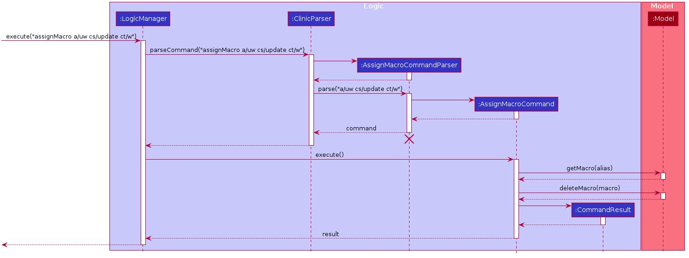

The user decides that he/she no longer needs the macro with the alias "uw" and decides to remove it. He does this by executing the `removemacro uw` command.

1. Parsing

   The input string will be passed to the `RemoveMacroCommandParser`. By matching the prefixes provided, `RemoveMacroCommandParser#parse` then attempts to create a new instance of `Alias` by parsing the arguments provided. If the `Alias` is
invalid, an exception will be thrown which will be shown as an error message on the GUI. Otherwise, a `RemoveMacroCommand` instance is created with the new `Alias`.

1. Execution

   `RemoveMacroCommand#execute` is then called with the model instance, which first attempts to retrieve the existing macro in the model with the `Alias` specified by calling the `model#getMacro` method.
This macro is returned in an optional wrapper, and an exception will be thrown if it is empty, where an error message will be displayed on the GUI. Otherwise, the
retrieved macro will be removed from the model.

1. Result Display

   The `RemoveMacroCommand#execute` then passes a `CommandResult` with a success message back to the `LogicManager`. Finally, the model is saved and the GUI is updated with the success message.

1. Result Display  

    The `RemoveMacroCommand#execute` then passes a `CommandResult` with a success message back to the `LogicManager`. Finally, the model is saved and the GUI is updated with the success message.

    The following activity diagram summarizes what happens when a user updates a product:
    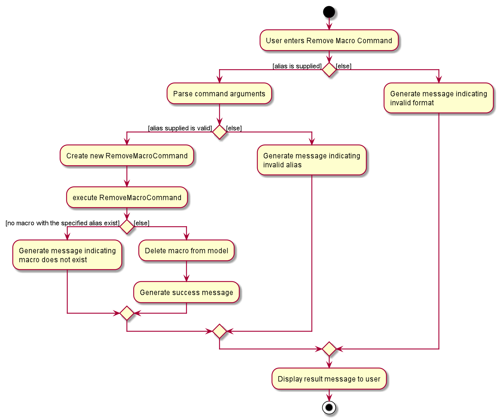

### List Macros feature

#### What the List macros feature does

The list macros feature allows users to be able to view all presently saved macros in the application.

#### How it is implemented

The list macros feature is facilitated by the `ListMacroCommand`    , whose job is to retrieve to list of macros and process it into a suitable format to be displayed to the user.

Given below is an example usage scenario

The user decides to check what macros he/she has saved before. The user does this by executing the `listmacro` command.

1. Parsing

   Since there are no arguments needed for this command, the `ClinicParser` directly creates the `ListMacroCommand`.

1. Execution

   `LogicManager` will then call `ListMacroCommand#execute` with the `Model` instance. `ListMacroCommand#execute` will retrieve the macro list from the `Model`.
If the list is empty, an exception is thrown which results in a message displayed on the GUI notifying the user that there are no presently saved macros.
Otherwise, the list of macros will be formatted into a readable format.

1. Result display

   The success message which contains the formatted list will be passed in a `CommandResult` to the `LogicManager`, to be displayed on the GUI without overriding the existing lists for suppliers and warehouses.

#### Why it is implemented this way

The main implementation consideration of this feature would be the display of the list. The list macros feature was implemented such that it does not use the same display section as the warehouse or supplier lists so that the user would not have to execute and additional command to restore the
supplier or warehouse lists. I decided not to include a separate display section to display the list of macros either as this feature is designed for advanced users and that the list of macros would not need to be displayed on
screen except when needed. Hence it is implemented such that it will be displayed with the success message instead, so that the user can quickly refer to the macro list and then proceed to use the intended macro straight after, where
it would then be no longer necessary to keep the macro list on the display.

### Undo/redo feature

The implementation of undo/redo takes reference from the [AddressBook3's proposed implementation](https://se-education.org/addressbook-level3/DeveloperGuide.html#proposed-undoredo-feature), with some modification
on the storage of versioned data.

#### Implementation

The current undo/redo mechanism is facilitated by `VersionedClinic`.
It extends `Clinic` with an undo/redo history, stored internally via `undoVersionStack` and `redoVersionStack`.
It also stores a `currentClinic` to facilitate the storing of current version of data into the correct stack.
Additionally, it implements 3 other major operations:

* `VersionedClinic#save()` — Saves the current CLI-nic version in its history.
* `VersionedClinic#undo()` — Recovers the previous CLI-nic version from its history.
* `VersionedClinic#redo()` — Restores a previously undone CLI-nic version from its history.

These operations are exposed in the `Model` interface as `Model#saveVersionedClinic()`, `Model#undoVersionedClinic()` and `Model#redoVersionedClinic()` respectively.

Given below is an example usage scenario and how the undo/redo mechanism behaves at each step.

Step 1. The user launches the application for the first time. The `VersionedClinic` will be initialized with the initial CLI-nic state, and the `currentClinic` pointing to that single CLI-nic state.

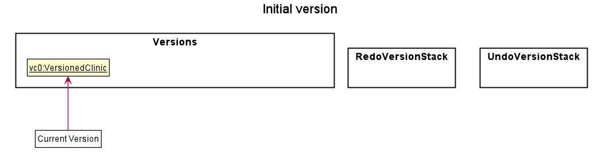

Step 2. The user executes `delete ct/w i/2` command to delete the 2nd warehouse in the displayed warehouse list.  
The `delete` command then calls `Model#saveVersionedClinic()`, causing the CLI-nic version prior to the warehouse deletion (i.e. the `currentClinic`) to be saved in the `undoVersionStack`, and the `currentClinic` is now updated to the newly modified version.

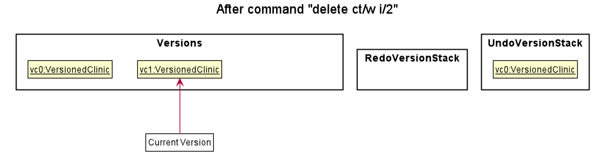

Step 3. The user executes `add ct/s n/David Co …​` to add a new supplier.  
The `add` command also calls `Model#saveVersionedClinic()`, causing the `currentClinic` version to be saved into the `undoVersionStack` again and updated to the newly modified version.

:information_source: **Note:** If a command fails its execution, it will not call `Model#saveVersionedClinic()`, so the `currentClinic` will not be saved into the `undoVersionStack` and updated.

Step 4. The user now decides that adding the supplier was a mistake and decides to undo that action by executing the `undo` command.  
The `undo` command will call `Model#undoVersionedClinic()`. The `undoVersionStack` will pop the most recent version of CLI-nic data stored, recovers the CLI-nic to that version.  
The `currentClinic` version will be stored in `redoVersionStack` and set to this most recent version popped.

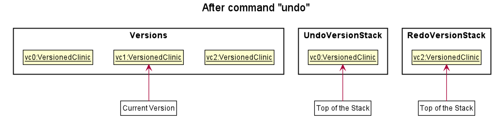

:information_source: **Note:** If the `undoVersionStack` is empty, suggesting to the initial CLI-nic version, then there are no previous CLI-nic version to recover. The `undo` command uses `Model#canUndoClinic()` to check if this is the case. If so, it will return an error to the user rather
than attempting to perform the undo.

The following sequence diagram shows how the undo operation works:

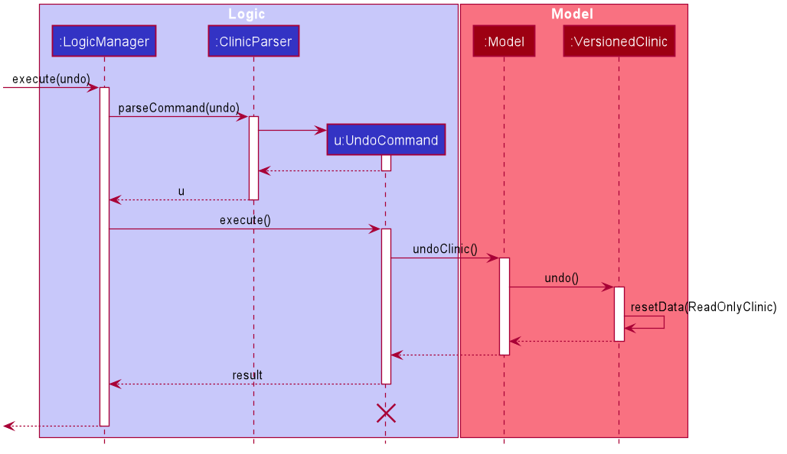

:information_source: **Note:** The lifeline for `UndoCommand` should end at the destroy marker (X) but due to a limitation of PlantUML, the lifeline reaches the end of diagram.

The `redo` command does the opposite — it calls `Model#redoClinic()`, which pops the most recent undone version of CLI-nic data from `redoVersionStack` and recovers the CLI-nic to that version.
Correspondingly, the `currentClinic` version will be stored in `undoVersionStack` and set to this most recent undone version popped.

:information_source: **Note:** If the `redoVersionStack` is empty, suggesting to the latest CLI-nic version, then there are no undone CLI-nic version to restore.
The `redo` command uses `Model#canRedoClinic()` to check if this is the case. If so, it will return an error to the user rather than attempting to perform the redo.

Step 5. The user then decides to execute the command `list`.  
Commands that do not modify the CLI-nic data, such as `list`, will not call `Model#saveVersionedClinic()`, `Model#undoVersionedClinic()` or `Model#redoVersionedClinic()`.
Thus, the `undoVersionStack`, `redoVersionStack` and `currentClinic` remain unchanged.

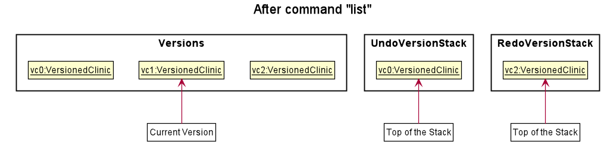

Step 6. The user executes `clear`, which calls `Model#saveVersionedClinic()`.  
Note here all CLI-nic versions stored the `redoVersionStack` will be purged. Reason: It no longer makes sense to redo the `add ct/s n/David Co …​` command. This is the behavior that most modern desktop applications follow.

:information_source: **Note:** It is common practice to remove any redoable version of data after each editing on the current data. For example, type `test` in any .txt file, undo once and type `new` again. Then trying to redo the previous undone text editing will not work.

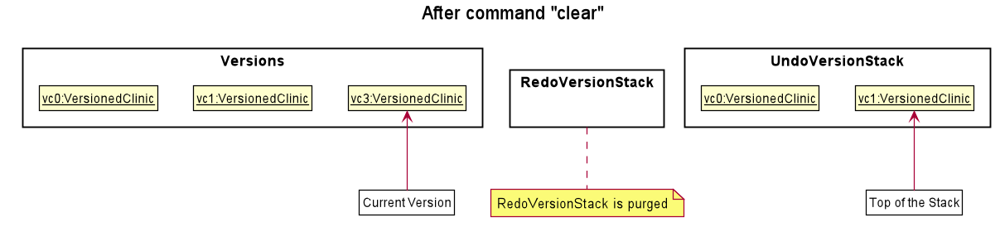

The following activity diagram summarizes what happens when a user executes a new command:

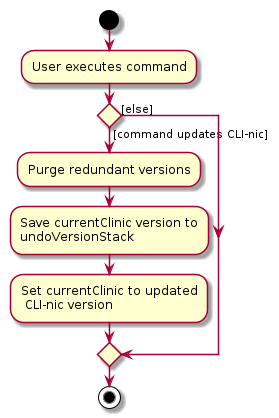

#### Aspect: How undo & redo executes

* **Alternative 1 (current choice):** Saves the entire CLI-nic into two stacks for undo and redo.
  * Pros: Easy to implement.
  * Cons: May have performance issues in terms of memory usage.

* **Alternative 2:** Individual command knows how to undo/redo by
  itself.
  * Pros: Will use less memory (e.g. for `delete`, just save the warehouse/supplier being deleted).
  * Cons: We must ensure that the implementation of each individual command are correct.

### Update product feature

#### What the update product feature does

The update product feature allows users to modify the quantity or tags of existing products listed under suppliers and warehouses, or add new products to their existing lists.

#### How it is implemented
The update product mechanism is facilitated by 3 major components: `UpdateCommandParser`, `UpdateCommand`, and the `UpdateProductDescriptor`.
`UpdateCommandParser`'s job is to parse the user input to generate the correct `Type`, `Name`, `Index`, and `AssignMacroDescriptor` objects for the `UpdateCommand`.
`UpdateCommand`'s job is to execute the main logic for generating the updated list of products for the model.
`UpdateProductDescriptor`'s job is to serve as a medium to allow the `UpdateCommandParser` to pass a specification of the updated product to the `UpdateCommand`.

Given below is an example usage scenario, together with a sequence diagram, to show how the update product mechanism behaves at each step.
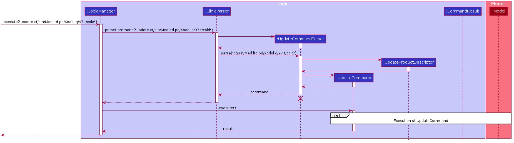

After using the `list` command to display all warehouses and suppliers, the user decides to update the stock for a product called 'Xodol' with a new quantity of 97 units
in the warehouse at index 1 of the warehouse list. The user also decides that he wants to give 'Xodol' a tag 'cold'.
The user does this by executing the `update ct/w i/1 pd/Xodol q/97 t/cold` command.

1. Parsing

   The input string will be passed to the `UpdateCommandParser`. By matching the prefixes provided, `UpdateCommandParser#parse` then attempts to create new instances of `Index` for the supplier/warehouse
and a new `Name` for the product. A new `UpdateProductDescriptor` will then be created with the provided quantity and tags, if any. An exception will be thrown if any of the arguments are invalid, or if the type, index and product name are not supplied. If so, an error message will be presented on the GUI.
Otherwise, the method will create an `UpdateCommand` with the `Type`, the warehouse/supplier `Index`, the product's `Name`, and the `UpdateProductDescriptor`.

1. Execution

   The following sequence diagram zooms in on how the `UpdateCommand#execute` is implemented:
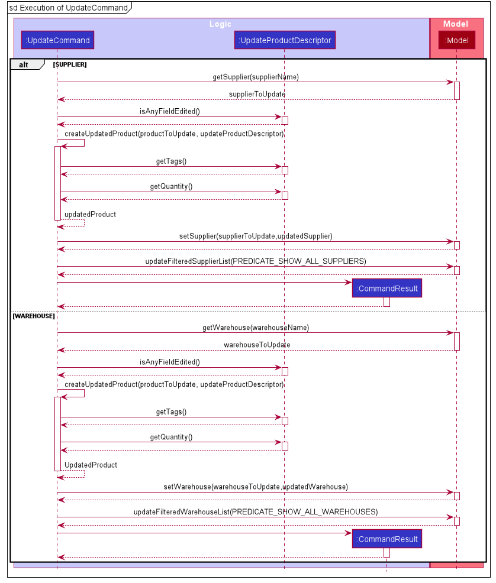

   `UpdateCommand#execute` is called with the `Model` instance. The method will first retrieve the filtered warehouse/supplier list from the model. The method then attempts to retrieve the warehouse/supplier from the list at the supplied index. If the index is greater than the size of the supplier/warehouse list, `CommandException` is thrown, otherwise, the `UpdateCommand#execute`
method copies the existing product set for that warehouse/supplier to a new `Set<Product>`.

   `UpdateCommand#execute` then checks if a `Product` of the same `Name` as the `Product` to be updated exists in the `Set<Product>`.
If the `Product` exists, the method does an additional check to ensure that either the tag(s) or quantity (or both)
is supplied in the `UpdateProductDescriptor`, failing which, an exception is thrown. If the check passes, the original
`Product` is removed from the set.

   `UpdateCommand#createUpdatedProduct` then creates a new product based on the product name and `UpdateProductDescriptor`. The `execute` method then adds the updated `Product` to the `Set<Product>`, and creates an updated
warehouse/supplier with the updated product. The method then updates the model with the edited warehouse/supplier, and the `FilteredWarehouseList` to be displayed to the user later.

1. Result display

   The method then passes a `CommandResult` with a success message back to the `LogicManager`. Finally, the model
is saved and the GUI is updated with the success message.

The following activity diagram summarizes what happens when a user updates a product:
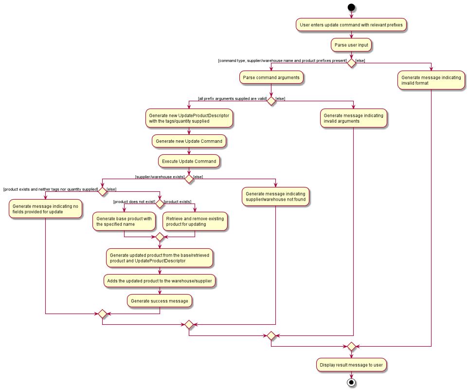

#### Why it is implemented this way and what alternatives were considered
The main design considerations associated to the feature include:

* Should the command be separated for suppliers and warehouses.
* What should the format of the command be.
* Should the adding of new products be facilitated by this command or should it only deal with existing products.
* How should the feature enforce separate requirements for new and existing products.

The consideration of whether there should be separate commands to update products under warehouses or suppliers firstly depend on the similarity between the products under both types.
Initially, we considered that supplier products should only have fields for names and tags, while the warehouse products should only have fields for quantities, as it is arguable that the quantity for suppliers
 may not be known, and that tagging of warehouse products may not be very important. However, we later decided that it is better to give users this flexibility to include any
 tags or quantities associated to the product regardless of supplier or warehouse, as these requirements may differ from user to user, and it may not be beneficial to restrict users as such.
 Then this decision would mean that the updating of products for warehouse and supplier was very similar, and hence we felt that it may also be more user-friendly to combine the 2 into
 one command so that users do not need to learn an additional command.

Initially, the supplier/warehouse to update the product was referenced by the user using the warehouse/supplier's full name. This allowed the user to update the specific supplier/warehouse regardless of the list view
so that the same update command will reproduce the same results regardless of the display, and so that the user does not have to enter an additional list command if the supplier/warehouse is not presently displayed.
However, this would mean that if the user is manually typing the command, it would be take a long time to enter the command if the supplier/warehouse name is very long, and it is also more prone to typos. Hence we decided
to make the compromise to use list indexing instead, standardising the format with the other commands, as we felt that for most use cases, using the index to reference the supplier/warehouse would be more efficient for the user,
 and that was our main priority.

Similar to the decision to combine the command for both supplier and warehouse, we decided to allow the update product command to add the product to the warehouse/supplier even if it does not presently exist for that supplier/warehouse, instead of having a separate command
just for adding products, so as to minimise the total number of commands. With this, all product additions and modifications (excluding deletion) will be processed by the same update command, which also removes the need for users to
check if a product exists for a supplier/warehouse before updating the product listing.

This combination of commands, however, brings up the consideration of how to enforce the separate requirements for new and existing products. Specifically, if it is a new product,
it is logical that the user may not supply the tag or quantity prefixes, but if it is an existing product, then not specifying both prefixes would mean that the user is not performing
any update at all. Hence the user should be required to supply at least 1 of the 2 optional prefixes mentioned above for adding new products, which would mean the application should show an error message if the user does not specify either of the optional arguments
and the product does not exist under the specified warehouse/supplier in the model. In general, however, the check of whether certain prefixes are supplied falls under the role of the `Parser` classes,
while the check of whether an entity exists in the model falls under the role of the `Command` classes, where the `Parser` is independent of the model. Hence we decided to implement an additional `UpdateProductDescriptor` class to provide a wrapper of
the product specification so that both checks can be done by the `UpdateCommand` without exposing the implementation details of the prefixes to the `UpdateCommand` class or using null values in the `UpdateCommand` fields. The `UpdateCommand` can then use the `UpdateProductDescriptor`
to both execute the checks and create the updated product.

### View feature
The `view` feature will be elaborated in this section by its functionality and path execution with the aid of Sequence and Activity Diagrams.

#### What View feature does
`view` command allows user to view a particular warehouse or supplier in warehouse or supplier list displayed.

This allows users to view the details of a specific warehouse or supplier which they might be interested to contact for further details. This feature is optimised to be used with `find` command.

For each command, only one warehouse or one supplier can be requested for viewing.

#### Path Execution of View Command
The workflow of a `view` command when it is executed by a user is shown in the Activity Diagram below:

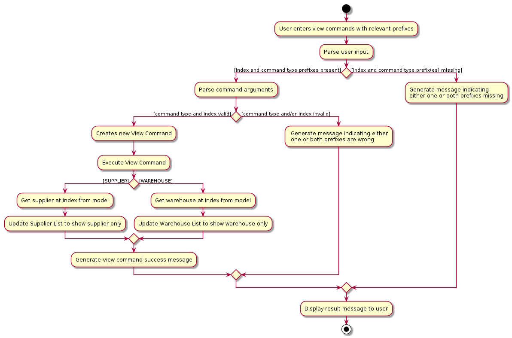

Important features of the Activity Diagram are as follows:

1. When a user's input is parsed, `ViewCommandParser` checks if both command type and index are present in the input.

   A `ParseException` will be thrown if either one or both are missing in user's input.

1. Only 2 `COMMAND_TYPE` are allowed. They are `ct/s` and `ct/w`.

   Any invalid values for prefixes (e.g. invalid `COMMAND_TYPE` specified), a `ParseException` will be thrown.

1. If parsing is successful, `ViewCommand` will be created and executed.

   If `INDEX` specified by user is greater than the size of supplier or warehouse list, a `CommandException` will be thrown.

1. At the end, a `view` command success message will be displayed and the relevant supplier or warehouse list GUI will only show the requested supplier or warehouse.

The logical workflow of this process is further explained in the Sequence Diagram below:

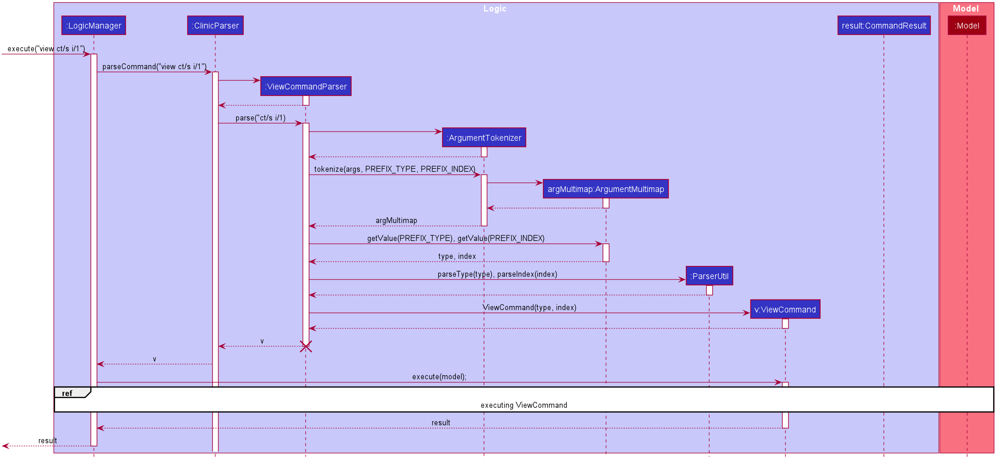

1. Parsing

   Upon receiving user's input, `ViewCommandParser#parse` will be invoked.

   As mentioned in above section, a `ParseException` will be thrown if the values specified for prefixes are invalid (e.g. wrong type or does not conform to constraints of the prefixes).

   Any wrong prefixes present will also result in `ParseException`.

   `ViewCommand` is then created and executed.

1. Execution

   The workflow for an execution of `ViewCommand` is as shown in the Sequence Diagram below:

   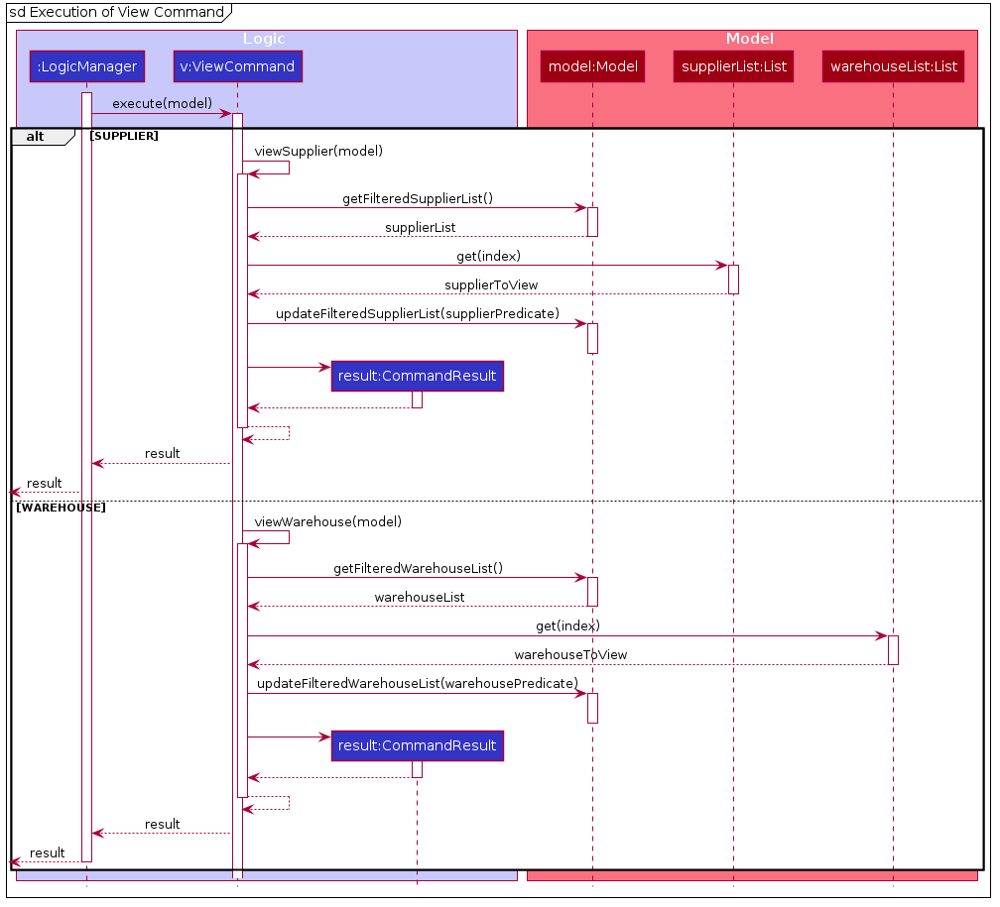

   Supplier or warehouse at the specified index is first retrieved from `supplierList` or `warehouseList` currently displayed in GUI accordingly.

   `Predicate` containing the supplier or warehouse name will be created and parsed into `updateFilteredSupplierList` or `updateFilteredWarehouseList` method under `Model` class.

    This results in only the display of specified supplier or warehouse in the list.

1. Result display

   An execution success message of `ViewCommand` will be displayed to user. The GUI of supplier or warehouse list will only display the requested supplier or warehouse.

   In the success message, products associated with the specified supplier or warehouse will be shown as well.

#### Why View feature is implemented this way
`view` command contains standardise prefix as with other commands in **CLI-nic** to help user learn usage at a faster rate. In addition, a choice to view by `index` instead of by `name` ensures efficiency since users do not need to key in the full name of supplier or warehouse.

In addition, it was intentional for the success message to display the list of products associated with the supplier or warehouse requested.

This allows **CLI-nic** to be CLI friendly, where users need not click on product pane to display the list of products.

This is further optimised with `find` as users can find by for instance, `name` or `remark` associated to a particular supplier or warehouse. With the filtered supplier or warehouse list displayed, they can view the products associated to a supplier or warehouse by using the `view` feature.

--------------------------------------------------------------------------------------------------------------------

## **Documentation, logging, testing, configuration, dev-ops**

* [Documentation guide](Documentation.md)
* [Testing guide](Testing.md)
* [Logging guide](Logging.md)
* [Configuration guide](Configuration.md)
* [DevOps guide](DevOps.md)

--------------------------------------------------------------------------------------------------------------------

## **Appendix: Requirements**

### Product scope

**Target user profile**:

* manager of a medical supplies company that manages warehouses across the country
* tech-savvy manager who prefers typing but still comfortable with clicking
* keeps track of supplies in each warehouse
* needs to quickly identify which suppliers to contact when restocking medical supplies

**Value proposition**:

* manages suppliers/warehouses information conveniently
* helps to retrieve and identify key suppliers/warehouses information quickly

### User stories

Priorities: High (must have) - `* * *`, Medium (nice to have) - `* *`, Low (unlikely to have) - `*`

| Priority | As a …​                                 | I want to …​                | So that I can…​                                                        |
| -------- | ------------------------------------------ | ------------------------------ | ------------------------------------------------------------------------- |
| `* * *`  | standard user  | access command history | recall, edit and reuse long or complicated commands with ease without having to retype them |
| `* * *`  | standard user  | add my suppliers' information and products offered | easily refer to the contacts and give them a call for updates on their supply availability     |
| `* * *`  | standard user  | add details of warehouses and stocks for each product | easily keep track of the stocks in each of my warehouse |
| `* * *`  | standard user  | add remarks to a supplier entry         | note down details that are specific to the supplier          |
| `* * *`  | standard user  | access the command list/user guide  | easily refer to instructions for commands and guidance for usage    |
| `* * *`  | standard user  | clear all suppliers and warehouses entries in one command | easily remove all entries if I am managing a new group of suppliers and warehouses |
| `* * *`  | standard user  | delete a supplier/warehouse entry   | remove suppliers/warehouses no longer operating |
| `* * *`  | standard user  | delete a particular product from a supplier/warehouse entry   | remove product no longer sold/stored for the supplier/warehouse|
| `* * *`  | standard user  | edit the information of a specific warehouse or supplier          | easily update any changes in contact information of a particular supplier/warehouse |
| `* * *`  | standard user  | find relevant supplier(s) or warehouse(s) | locate relevant supplier(s) or warehouse(s) without having to go through the entire supplier list or warehouse list |
| `* * *`  | standard user  | list all warehouses or suppliers     | easily see all the suppliers and warehouses I oversee|
| `* * *`  | standard user  | view the information of a specific warehouse or supplier          | retrieve details about the supplier/warehouse I can't remember and contact them       |
| `* * *`  | standard user  | view the products of a specific warehouse          | retrieve products associated with the warehouse to see if restocking is needed   |
| `* * *`  | standard user  | view the products of a specific supplier        | retrieve products associated with the supplier to see if they have enough stocks for me to place an order   |
| `* * *`  | standard user  | Undo my previous editing on the data    | fix any wrong entry into the data if I've done so by mistake|
| `* * *`  | standard user  | redo my previous undone editing on the data    | recover the undone editing earlier if I want those editing back|
| `* * * ` | standard user | update the information for a specific product in warehouses and suppliers | keep track of the changes in the stocks of the warehouses |
| `* *`    | advanced user | create custom alias for my commands | so that I enter commands more efficiently |
| `* *`    | advanced user | delete a custom alias | remove the aliases that I no longer need |
| `* *`    | advanced user | list my saved macros | quickly recall which macros I can currently use  |
| `*`      | beginner user | have command autocomplete | enter commands faster |
| `*`      | beginner user | see the syntax of the command as I type into the command line | refer to the documentation less frequently |

### Use cases

(For all use cases below, the **System** is the `CLI-nic` and the **Actor** is the `user`, unless specified
 otherwise)

**Use case: UC01 Add a warehouse**

**MSS**

1. User keys in command to add a warehouse.
2. CLI-nic adds the warehouse into the list and shows a success message.

    Use case ends.

**Extensions**

* 1a. CLI-nic detects invalid syntax in the entered warehouse info.

  * 1a1. CLI-nic shows an error message.
  * 1a2. CLI-nic requests for the correct syntax of warehouse info.
  * 1a3. User enters new data.

    Steps 1a1-1a3 are repeated until the data entered are valid.  
    Use case resumes from step 2.

* 1b. CLI-nic detects addition of duplicated warehouse.

  * 1b1. CLI-nic shows duplicated warehouse message.
  * 1b2. CLI-nic requests for a different warehouse.
  * 1b3. User enters new data.

    Steps 1b1-1b3 are repeated until the data entered are valid.  
    Use case resumes from step 2.

**Use case: UC02 Add a supplier**

**MSS**

1. User keys in command to add a supplier.
2. CLI-nic adds the supplier into the list and shows a success message.

    Use case ends.

**Extensions**

* 1a. CLI-nic detects an error in the entered supplier info.

  * 1a1. CLI-nic shows an error message .
  * 1a2. CLI-nic requests for valid data.
  * 1a3. User enters new data.

    Steps 1a1-1a3 are repeated until the data entered are valid.  
    Use case resumes from step 2.

**Use case: UC03 Assign a macro**

**MSS**

1. User keys in command to assign a macro with an alias and a command string to be saved.
2. CLI-nic saves the macro and shows a success message.

    Use case ends.

**Extensions**

* 1a. The alias or command string supplied is invalid.

  * 1a1. CLI-nic shows an error message with the constraints for the fields required.
  * 1a2. User enters a new command.

    Steps 1a1-1a2 are repeated until the data entered is valid.  
    Use case resumes from step 2.

* 1b. The command supplied is not in the valid format.

  * 1b1. CLI-nic shows an error message and the valid format, along with examples of the valid usage.
  * 1b2. User enters a new command.

    Steps 1b1-1b2 are repeated until the command format is valid.  
    Use case resumes from step 2.

* 1c. An existing macro with the same alias as the one supplied is found.

  * 1c1. CLI-nic shows an error message, notifying the user of the conflict.
  * 1c2. User enters a new command with a new alias.

    Steps 1c1-1c2 are repeated until the alias supplied does not already exist in CLI-nic.  
    Use case resumes from step 2.

**Use case: UC04 Clear all supplier and warehouse entries**

**MSS**

1. User requests to clear the data in the application.
2. CLI-nic clears all supplier and warehouse entries, shows empty lists of suppliers and warehouses and shows a success message.

    Use case ends.

**Use case: UC05 Delete a supplier**

**MSS**

1. User requests to view a specific supplier by keyword.
2. CLI-nic shows the specific supplier and its index.
3. User deletes the supplier via its index in the list.
4. CLI-nic deletes the supplier in the list and shows a success message.

    Use case ends.

**Extensions**

* 2a. The supplier list is empty.

  * 2a1. CLI-nic informs the user there is no supplier in the list currently.

    Use case ends.

* 3a. The given index is invalid.

  * 3a1. CLI-nic shows an error message and gives command suggestions.
  * 3a2. User enters the new supplier index.

    Steps 3a1-3a2 are repeated until the data entered are valid.  
    Use case resumes at step 4.

* 3b. The given command format is incorrect.

  * 3b1. CLI-nic shows an error message and gives command suggestions.
  * 3a2. User enters the new command input.

      Steps 3b1-3b2 are repeated until the data entered are valid.  
      Use case resumes at step 4.

**Use case: UC06 Delete a warehouse**

**MSS**

1. User requests to view a specific warehouse by keyword.
2. CLI-nic shows the specific warehouse and its index.
3. User deletes the warehouse via its index in the list.
4. CLI-nic deletes the warehouse in the list and shows a success message.

    Use case ends.

**Extensions**

* 2a. The warehouse list is empty.

  * 2a1. CLI-nic informs the user there is no warehouse in the list currently.

    Use case ends.

* 3a. The given index is invalid.

  * 3a1. CLI-nic shows an error message and gives command suggestions.
  * 3a2. User enters the new warehouse index.

    Steps 3a1-3a2 are repeated until the data entered are valid.
    Use case resumes at step 4.

* 3b. The given command format is incorrect.

  * 3b1. CLI-nic shows an error message and gives command suggestions.
  * 3a2. User enters the new command input.

      Steps 3b1-3b2 are repeated until the data entered are valid.  
      Use case resumes at step 4.

**Use case: UC07 Delete a product from a supplier**

**MSS**

1. User requests to view a specific supplier by keyword.
2. CLI-nic shows the specific supplier and its index.
3. User requests to delete a product from the supplier via the index returned and the product name displayed.
4. CLI-nic deletes the specified product from the target supplier and shows a success message.

    Use case ends.

**Extensions**

* 2a. The supplier list is empty.

  * 2a1. CLI-nic informs the user there is no supplier in the list currently.

    Use case ends.

* 3a. The given index is invalid.

  * 3a1. CLI-nic shows an error message and gives command suggestions.
  * 3a2. User enters the new supplier index.

    Steps 3a1-3a2 are repeated until the index entered is valid.  
    Use case resumes at step 4.

* 3b. The given name is invalid.

  * 3b1. CLI-nic shows an error message and gives command suggestions.
  * 3b2. User enters the new product name.

    Steps 3b1-3b2 are repeated until the name entered is valid.  
    Use case resumes at step 4.

**Use case: UC08 Edit a supplier**

**MSS**

1. User requests to edit a specific supplier according to the index in the supplier list displayed.
2. CLI-nic shows the specific supplier at that index.

    Use case ends.

**Extensions**

* 1a. The index specified is larger than the size of the supplier list.

  * 1a1. CLI-nic informs the user the index input is larger than the current size of supplier list displayed.
  * 1a2. User enters a new supplier index.

    Steps 1a1-1a2 are repeated until the index entered is within the size of the supplier list.

    Use case ends.

* 1a. User requests to edit the address of a specific supplier.

  * 1a1. CLI-nic informs the user that warehouse does not contain address.
  * 1a2. User removes address as a field to be edited.

    User case ends.

* 1a. User uses an invalid command format.

  * 1a1. CLI-nic informs user of the invalid command format.
  * 1a2. User enters a new edit command.

    Steps 1a1-1a2 are repeated until the index entered is valid.

    Use case ends.

**Use case: UC09 Edit a warehouse**

**MSS**

1. User requests to edit a specific warehouse according to the index in the warehouse list displayed.
2. CLI-nic shows the specific warehouse at that index.

    Use case ends.

**Extensions**

* 1a. The index specified is larger than the size of the warehouse list.

  * 1a1. CLI-nic informs the user the index input is larger than the current size of warehouse list displayed.
  * 1a2. User enters a new warehouse index.

    Steps 1a1-1a2 are repeated until the index entered is within the size of the warehouse list.

    Use case ends.

* 1a. User requests to edit the email address of a specific warehouse.

  * 1a1. CLI-nic informs the user that warehouse does not contain email address.
  * 1a2. User removes email address as a field to be edited.

    User case ends.

* 1a. User uses an invalid command format.

  * 1a1. CLI-nic informs user of the invalid command format.
  * 1a2. User enters a new edit command.

    Steps 1a1-1a2 are repeated until the index entered is valid.

    Use case ends.

**Use case: UC10 Find Supplier(s)**

**MSS**

1. User enters the command to find the relevant supplier(s).
2. CLI-nic displays all relevant supplier(s) and shows a success message.

    Use case ends.

**Extensions**

* 1a. User enters an invalid command format for finding supplier(s).

  * 1a1. CLI-nic informs user of the invalid command.
  * 1a2. User enters a new command.

    Steps 1a1 and 1a2 are repeated until a valid command format for finding supplier(s) is entered. 
    Use case resumes at step 2.

**Use case: UC11 Find Warehouse(s)**

**MSS**

1. User enters the command to find the relevant warehouse(s).
2. CLI-nic displays all the relevant warehouse(s) and shows a success message.

    Use case ends.

**Extensions**

* 1a. User enters an invalid command format for finding warehouse(s).

  * 1a1. CLI-nic informs user of the invalid command.
  * 1a2. User enters a new command.

    Steps 1a1 and 1a2 are repeated until a valid command format for finding warehouse(s) is entered. 
    Use case resumes from step 2.

**Use case: UC12 List all supplier and warehouse entries**

**MSS**

1. User requests to list the supplier and warehouse data in the application.
2. CLI-nic retrieves all supplier and warehouse entries, shows lists of suppliers and warehouses and shows a success message.

    Use case ends.

**Use case: UC13 List all macros**

**MSS**

1. User requests to list the macros saved in the application.
2. CLI-nic retrieves all presently saved macros and shows it on the GUI.

    Use case ends.

**Extensions**

* 1a. There are no presently saved macros.

  * 1a1. CLI-nic shows a message to notify the user that no macros were found.

    Use case ends.

**Use case: UC13 Remove a macro**

**MSS**

1. User keys in command to remove a macro with a specified alias.
2. CLI-nic removes the macro and shows a success message.

    Use case ends.

**Extensions**

* 1a. The alias supplied is invalid.

  * 1a1. CLI-nic shows an error message with the constraints for the alias specified.
  * 1a2. User enters a new command.

    Steps 1a1-1a2 are repeated until the alias entered is valid.  
    Use case resumes from step 2.

* 1b. The command supplied is not in the valid format.

  * 1b1. CLI-nic shows an error message and the valid format, along with examples of the valid usage.
  * 1b2. User enters a new command.

    Steps 1b1-1b2 are repeated until the command format is valid.  
    Use case resumes from step 2.

* 1c. An existing macro with the alias supplied cannot be found.

  * 1c1. CLI-nic shows an error message, notifying the user that the macro does not exist.
  * 1c2. User enters a new command with another alias.

    Steps 1c1-1c2 are repeated until a macro with the new alias supplied is found.  
    Use case resumes from step 2.

**Use case: UC15 Update a Product in a Supplier**

**MSS**

1. User keys in command to update a product in a supplier with updated quantity/tags.
2. CLI-nic overwrites the existing product with the updated product details. CLI-nic shows a success message.

    Use case ends.

**Extensions**

* 1a. The index specified is not a valid under the supplier list.
  * 1a1. CLI-nic shows an error message informing the user that the index is not valid.
  * 1a2. User enters a new index.

    Steps 1a1-1a2 are repeated until the index supplied is valid.  
    Use case resumes from step 2.

* 1b. User enters the command in an invalid format.
  * 1b1. CLI-nic shows an error message and displays the valid format together with examples.
  * 1b2. User enters a new command.

    Steps 1b1-1b2 are repeated until the command provided by the user adheres to the valid format.  
    Use case resumes from step 2.

* 1c. The product exists in the supplier but neither the quantity nor the tags was supplied in the command.
  * 1c1. CLI-nic shows an error message and informs the user that either the tags or quantity (or both) has to be supplied.
  * 1c2. User enters a new command.

    Steps 1c1-1c2 are repeated until the command provided by the user has either a quantity or tags specified for the product.  
    Use case resumes from step 2.

* 1d. The product name, quantity, or tags are invalid.
  * 1d1. CLI-nic shows an error message informing the user of the constraints that the fields supplied must adhere to.
  * 1d2. User enters a new command.

    Steps 1d1-1d2 are repeated until all the fields required by the command are valid.  
    Use case resumes from step 2.

* 1e. The product does not exist in the Supplier.
  * 1e1. CLI-nic adds the product with its associated quantity/tags to the supplier.
    Use case ends.

**Use case: UC16 Update a Product in a Warehouse**

**MSS**

1. User keys in command to update a product in a warehouse with updated quantity/tags.
2. If the product exists, CLI-nic overwrites the existing product with the updated product details. If the product does not exist, CLI-nic adds the product and its associated quantity/tags to the warehouse. CLI-nic shows a success message.

    Use case ends.

**Extensions**

* 1a. The index specified is not a valid under the warehouse list.
  * 1a1. CLI-nic shows an error message informing the user that the index is not valid.
  * 1a2. User enters a new index.

    Steps 1a1-1a2 are repeated until the index supplied is valid.  
    Use case resumes from step 2.

* 1b. User enters the command in an invalid format.
  * 1b1. CLI-nic shows an error message and displays the valid format together with examples.
  * 1b2. User enters a new command.

    Steps 1b1-1b2 are repeated until the command provided by the user adheres to the valid format.  
    Use case resumes from step 2.

* 1c. The product exists in the warehouse but neither the quantity nor the tags was supplied in the command.
  * 1c1. CLI-nic shows an error message and informs the user that either the tags or quantity (or both) has to be supplied.
  * 1c2. User enters a new command.

    Steps 1c1-1c2 are repeated until the command provided by the user has either a quantity or tags specified for the product.  
    Use case resumes from step 2.

* 1d. The product name, quantity, or tags are invalid.
  * 1d1. CLI-nic shows an error message informing the user of the constraints that the fields supplied must adhere to.
  * 1d2. User enters a new command.

    Steps 1d1-1d2 are repeated until all the fields required by the command are valid.  
    Use case resumes from step 2.

* 1e. The product does not exist in the warehouse.
  * 1e1. CLI-nic adds the product with its associated quantity/tags to the warehouse.
    Use case ends.

**Use case: UC17 View Help**

**MSS**
1. User asks for the list of command.
2. CLI-nic displays information about all the commands and contains sample commands that the user can try out.
3. User tries out commands listed under help to familiarise themselves with CLI-nic.

    Use case ends.

**Extensions**

* 1a. User asks for a specific command via the command keyword.
  * 1a1. CLI-nic displays instruction on how the command they ask can be used. Sample command call will also be given.
  * 1a2. User follows the instruction to try out command they asked to familiarise themselves with this command.

    Use case ends.

* 1b. User enters invalid help command.
  * 1b1. CLI-nic shows an error message.
  * 1b2. CLI-nic requests for a valid command.
  * 1b3. User enters a new help command.

    Steps 1b1-1b3 are repeated until a valid help command is entered.  
    Use case resumes from step 2.

**Use case: UC18 View Supplier**

**MSS**

1. User enters command to view supplierA information.
2. CLI-nic displays all of supplierA information, including contact number and any notes such as “fast supplier”.
3. User looks through the information of supplierA displayed and might call up the supplier if necessary.

    Use case ends.

**Extensions**

* 1a User enters invalid supplier name.
  * 1a1. CLI-nic requests for new supplier name.
  * 1a2. User enters a new supplier name.

    Steps 1a1 and 1a2 are repeated until a valid supplier name is entered.  
    Use case resumes from step 2.

**Use case: UC19 View Warehouse**

**MSS**

1. User enters command to view WarehouseA information.
2. CLI-nic displays all of WarehouseA information, including contact number and any notes such as “first warehouse”.
3. User looks through the information of WarehouseA displayed and might call up the warehouse if necessary.

    Use case ends.

**Extensions**

* 1a User enters invalid warehouse name.
  * 1a1. CLI-nic requests for new warehouse name.
  * 1a2. User enters a new warehouse name.

    Steps 1a1 and 1a2 are repeated until a valid warehouse name is entered.  
    Use case resumes from step 2.

--------------------------------------------------------------------------------------------------------------------
### Use cases [Coming Soon]

**Use case: UC00 Create a purchase order**

**MSS**

1. User requests to create a purchase order with a specific supplier, store, and a list of products and their quantities
2. CLI-nic creates the purchase order

    Use case ends.

**Extensions**

* 1a. Any of the given names are invalid.
  * 1a1. CLI-nic shows an error message.
  * 1a2. User enters new names for the command.

    Steps 1a1 and 1a2 are repeated until all the given names are valid.  
    Use case resumes from step 2.

* 1b. The number of products names supplied and the number of product quantities given do not match.
  * 1b1. CLI-nic shows an error message.
  * 1b2. User enters the command again with the new products and quantities.

    Steps 1b1 and 1b2 are repeated until the products and their quantities match.  
    Use case resumes from step 2.

* 1c. Any one of the arguments is not supplied.
  * 1c1. CLI-nic shows an error message.
  * 1c2. User enters the command again.

    Steps 1c1 and 1c2 are repeated until all required arguments are supplied.  
    Use case resumes from step 2.

*{More to be added}*

### Non-Functional Requirements

1.  Should work on any _mainstream OS_ if it has Java `11` or above installed.
1.  A user with above average typing speed for regular English text (i.e. not code, not system admin commands) should be able to accomplish most of the tasks faster using commands than using the mouse.
1.  The files used to store information about suppliers and warehouses should be independent from the files used to store information about macros and the command history.
1.  The system should recognize common French/German letters as they may appear in the name of medical products.
1.  The system should be able to track > 1k suppliers, > 1k warehouses, > 1k medical supplies without a noticeable sluggishness in performance for typical usage.
1.  The size of the application excluding the data files should be minimal (< 30MB).
1.  The system should work off-line.
1.  The system stores data locally.

*{More to be added}*

### Glossary

* **Mainstream OS**: Windows, Linux, Unix, OS-X
* **Private contact detail**: A contact detail that is not meant to be shared with others
* **Medical products/supplies**: The items / tools / medicine consumed by patients
* **Supplier**: The companies / entities providing the sources of medical products
* **Warehouse**: The places where the medical supplies are channelled to and kept. The storage condition of these warehouses is managed by the manager, which is our app user
* **Alias**: A user-specified `String` that can be used to represent another `String` (e.g. typing `uw`
    is equivalent to typing `update ct/w` after this command `assignmacro a/uw cs/update ct/w` has been executed)

### Command Prefix

:information_source:  Note: Commands common to Supplier and
Warehouse are directed to Supplier by default.

|Prefix   |Meaning  |Used in the following Command(s)|
| ------- |-------- | ------------ |
|a/ |Alias |[Assign Macro](UserGuide.html#assigning-macro-to-selected-command-string-assignmacro)|
|addr/ |Address |[Add](UserGuide.html#adding-a-warehouse--add), [Edit](UserGuide.html#editing-a-warehouse--edit) |
|cs/ |Command String |[Assign Macro](UserGuide.html#assigning-macro-to-selected-command-string-assignmacro)|
|ct/ |Command Type |[Add](UserGuide.html#adding-a-supplier--add), [Delete](UserGuide.html#deleting-a-supplier--delete), [Edit](UserGuide.html#editing-a-supplier--edit), [Find](UserGuide.html#finding-relevant-suppliers-find), [Update](UserGuide.html#updating-the-quantity-andor-tags-of-a-product-sold-by-a-supplier-update), [View](UserGuide.html#viewing-a-specific-supplier-view) |
|e/ |Email Address |[Add](UserGuide.html#adding-a-supplier--add), [Edit](UserGuide.html#editing-a-supplier--edit) |
|i/ |Index |[Delete](UserGuide.html#deleting-a-supplier--delete), [Edit](UserGuide.html#editing-a-supplier--edit), [Update](UserGuide.html#updating-the-quantity-andor-tags-of-a-product-sold-by-a-supplier-update), [View](UserGuide.html#viewing-a-specific-supplier-view) |
|n/ |Supplier/Warehouse Name |[Add](UserGuide.html#adding-a-supplier--add), [Find](UserGuide.html#finding-relevant-suppliers-find) |
|p/ |Phone Number |[Add](UserGuide.html#adding-a-supplier--add), [Edit](UserGuide.html#editing-a-supplier--edit) |
|pd/ |Product Name |[Delete](UserGuide.html#deleting-a-supplier--delete), [Find](UserGuide.html#finding-relevant-suppliers-find), [Update](UserGuide.html#updating-the-quantity-andor-tags-of-a-product-sold-by-a-supplier-update) |
|q/ |Quantity of product |[Update](UserGuide.html#updating-the-quantity-andor-tags-of-a-product-sold-by-a-supplier-update) |
|r/ |Remark |[Add](UserGuide.html#adding-a-supplier--add), [Find](UserGuide.html#finding-relevant-suppliers-find), [Edit](UserGuide.html#editing-a-supplier--edit) |
|t/ |Product Tag |[Update](UserGuide.html#updating-the-quantity-andor-tags-of-a-product-sold-by-a-supplier-update) |

--------------------------------------------------------------------------------------------------------------------

## **Appendix: Instructions for manual testing**

Given below are instructions to test the app manually.

:information_source: **Note:** These instructions only provide a starting point for testers to work on;
testers are expected to do more *exploratory* testing.

All `index` referred to in this section refers to index in supplier or warehouse list currently displayed on GUI.

### Launch and shutdown

1. Initial launch

   1. Download the jar file and copy into an empty folder.

   1. Double-click the jar file.
      Expected: Shows the GUI with a set of sample contacts. The window size may not be optimum.

1. Saving window preferences

   1. Resize the window to an optimum size. Move the window to a different location. Close the window.

   1. Re-launch the app by double-clicking the jar file. 
       Expected: The most recent window size and location is retained.

1. Shutdown of CLI-nic
   1. Close the window. Alternatively, shutdown CLI-nic using `exit` command detailed below.
   1. All data added/edited prior to shutdown will be saved.
   1. Re-launch the app by double-clicking the jar file.
       Expected: All data added/edited prior to shutdown are displayed.

### Adding a supplier

1. Add command format: `add ct/s n/SUPPLIER_NAME p/PHONE e/EMAIL_ADDRESS [r/SUPPLIER_REMARK]`

   1. Test case: Minimal information e.g. `add ct/s n/John p/98766789 e/johndoe@example.com` 
      Expected: Adds a supplier with the above details to the list and is displayed on the GUI.

   1. Test case: With all fields supplied e.g. `add ct/s n/John Lagoon p/98766789 e/johndoe@example.com r/Fast delivery` 
      Expected: Adds the supplier to the list, including the remark.

   1. Test case: Invalid Prefix or missing compulsory Prefixes e.g. Case 1:`add ct/s n/John Lim p/98766789`
      or Case 2: `add ct/s n/John Tan p/98766789 z/friend e/johndoe@example.com` 
      Expected: No supplier is added. For Case 1, error details indicating that there are missing prefixes
      and the compulsory prefixes needed would be shown in the response message. For Case 2, error details
      indicating that one of the prefixes specified is not recognised would be shown in the response message.
      A usage message will be displayed for both cases to guide user accordingly. SupplierList on GUI
      remains unchanged.

   1. Test case: Add supplier with duplicate SUPPLIER_NAME e.g. `add ct/s n/John Doe p/98766789 e/johndoe@example.com` followed by `add ct/s n/John Doe p/91234567 e/johndot@example.com` 
      Expected: No supplier is added. Error details will be displayed, indicating that the supplier to be
      added already exists in CLI-nic and thus cannot be added. SupplierList on GUI remain unchanged.

### Adding a warehouse

1. Add command format: `add ct/w n/WAREHOUSE_NAME p/PHONE addr/ADDRESS [r/WAREHOUSE_REMARK]`

   1. Test case: Minimal information e.g. `add ct/w n/John Ptd Ltd p/98766789 addr/John street, block 123, #01-01` 
      Expected: Adds a warehouse with the above details to the warehouse list and is displayed on the GUI.

   1. Test case: With all fields supplied e.g. `add ct/w n/John Lagoon Ptd Ltd p/98766789 addr/John street, block 123, #01-01 r/Largest warehouse` 
      Expected: Adds the warehouse to the list, including the remark

   1. Test case: Invalid Prefix or missing compulsory Prefixes e.g. Case 1:`add ct/w n/John Lim Ptd Ltd p/98766789`
      or Case 2: `add ct/w n/John St Ptd Ltd p/98766789 z/large addr/John street, block 123, #01-01` 
      Expected: No warehouse is added. For Case 1, error details indicating that there are missing prefixes
      and the compulsory prefixes needed would be shown in the response message. For Case 2, error details
      indicating that one of the prefixes specified is not recognised would be shown in the response message.
      A usage message will be displayed for both cases to guide user accordingly. WarehouseList on GUI
      remains unchanged.

   1. Test case: Add warehouse with duplicate WAREHOUSE_NAME e.g. `add ct/w n/James Ptd Ltd p/98766789
      addr/John street, block 123, #01-01` followed by `add ct/w n/James Ptd Ltd p/91234567 addr/Ang Mo Kio
      street 12, block 3` 
      Expected: No warehouse is added. Error details will be displayed, indicating that the warehouse to
      be added already exists in CLI-nic and thus cannot be added. WarehouseList on GUI remain unchanged.

### Assigning a macro

1. Assign macro command format: `assignmacro a/ALIAS cs/COMMAND_STRING`

   1. Test case: Valid alias and command string e.g. `assignmacro a/uw cs/update ct/w` 
      Expected: A macro is created under the alias `uw` for the command string `update ct/w`. Details of the new macro is shown in the display message.

   1. Test case: Command string does not start with a pre-defined command e.g. `assignmacro a/uw cs/magic` 
      Expected: No macro created. Error details is shown in the displayed message.

   1. Test case: Alias clashes with a pre-defined command or another macro e.g. `assignmacro a/update cs/add` 
      Expected: No macro created. Error details is shown in the displayed message.

### Clearing CLI-nic

1. Clear command format: `clear`

   1. Test case: Clear command with no additional arguments e.g. `clear` 
      Expected: CLI-nic clears all suppliers and warehouses data in CLI-nic.

   1. Test case: Clear command with additional arguments e.g. `clear test` or `clear i/1` 
      Expected: Similar to previous.

### Deleting a Product from a Supplier/Warehouse

1. Delete command format: `delete ct/TYPE i/INDEX pd/PRODUCT_NAME`

   1. Prerequisites: List all suppliers/warehouses using the `list` command. At least one warehouse/supplier with some product in the list. First warehouse does not have the product `Panadol` while the first supplier has.

   1. Test case: `delete ct/pw i/1 pd/panadol` 
      Expected: The `Panadol` product in the first warehouse is deleted. Details of the deleted product shown in the status message.

   1. Test case: Invalid argument for the type specified e.g. `delete ct/w i/1 pd/Panadol` 
      Expected: No product is deleted. No warehouse is deleted as well. Error details shown in the status message. Status bar remains the same.

   1. Test case: Provided Index exceeds the length of the list e.g. `delete ct/pw i/1000 pd/Panadol` 
      Expected: No product is deleted. Error details is shown in the status message. Status bar remains the same.

   1. Test case: Provided product (by name) is not found in the product list of the supplier/warehouse e.g. `delete ct/pw i/1000 pd/P` 
      Expected: No product is deleted. Error details is shown in the status message. Status bar remains the same.

### Deleting a Supplier/Warehouse

1. Delete command format: `delete ct/TYPE i/INDEX`

   1. Prerequisites: List all suppliers/warehouses using the `list` command. At least one warehouse/supplier in the list.

   1. Test case: `delete ct/s i/1` 
      Expected: First supplier is deleted from the list. Details of the deleted supplier shown in the status message.

   1. Test case: Invalid argument for the type specified e.g. `delete ct/0` 
      Expected: No supplier is deleted. Error details shown in the status message. Status bar remains the same.

   1. Test case: Provided Index exceeds the length of the list e.g. `delete ct/s i/1000` 
      Expected: No supplier is deleted. Error details is shown in the status message.

### Editing a Supplier

1. Edit command format: `edit ct/s i/INDEX [n/NAME] [p/PHONE] [e/EMAIL] [r/REMARK]`

   1. Prerequisites: Suppliers in CLI-nic does not have a supplier named Alice Ptd Ltd.

   1. Test case: Minimal information e.g. `edit ct/s i/1 n/Alice Pte Ltd` 
      Expected: Edits a supplier in index 1 on supplier list to have a name "Alice Pte Ltd".

   1. Test case: With all fields supplied e.g. `edit ct/s i/1 n/Alice Pte Ltd p/90345623 e/alice@gmail.com r/First Supplier` 
      Expected: Edits a supplier in index 1 on supplier list with all the fields applied.

   1. Test case: Invalid Prefix or missing compulsory Prefixes.

      Case 1: `edit ct/s i/1 n/Alice Pte Ltd p/90345623 e/alice@gmail.com z/large `

      Case 2: `edit ct/s i/1` 
      Expected: No supplier is edited. For Case 1: Error message specifying that one of the prefixes used is not recognised will be shown. For Case 2: Error message specifying that at least one field to edit must be provided will be shown. A help message for edit command will also be displayed
      to guide user accordingly. SupplierList on GUI remains unchanged.

   1. Test case: Edits a supplier with existing SUPPLIER_NAME in list e.g. `edit ct/s i/1 n/Bob Pte Ltd` followed by `edit ct/s i/2 n/Bob Pte Ltd` 
      Expected: No supplier is edited. An error will occur and a message will be displayed, stating that the edited field result in no change to the supplier. It will also prompt users to do a check on the arguments to ensure that their inputs are correct. SupplierList on GUI remain unchanged.

### Editing a Warehouse

1. Edit command format: `edit ct/w i/INDEX [n/NAME] [p/PHONE] [addr/ADDRESS] [r/REMARK]`

   1. Prerequisites: Warehouses in CLI-nic does not have a warehouse named Alice Warehouse.

   1. Test case: Minimal information e.g. `edit ct/w i/1 n/Alice Warehouse`  
      Expected: Edits a warehouse in index 1 on warehouse list to have a name "Alice Warehouse".

   1. Test case: With all fields supplied e.g. `edit ct/w i/1 n/Alice Warehouse p/82345162 addr/21 Lower Kent Ridge Rd, Singapore 119077 r/Largest Warehouse` 
      Expected: Edits a warehouse in index 1 on warehouse list with all the fields applied.

   1. Test case: Invalid Prefix or missing compulsory Prefixes.

      Case 1: `edit ct/w i/1 n/Alice Warehouse p/82345162 addr/21 Lower Kent Ridge Rd, Singapore 119077 z/large `

      Case 2: `edit ct/w i/1` 
      Expected: No warehouse is edited. For Case 1: Error message specifying that one of the prefixes used is not recognised will be shown. For Case 2: Error message specifying that at least one field to edit must be provided will be shown. A help message for edit command will also be displayed
      to guide user accordingly. WarehouseList on GUI remains unchanged.

   1. Test case: Edits a warehouse with existing WAREHOUSE_NAME in list e.g. `edit ct/w i/1 n/Bob Warehouse` followed by `edit ct/w i/2 n/Bob Warehouse` 
      Expected: No warehouse is edited. An error will occur and a message will be displayed, stating that the edited field(s) result in no change to the warehouse. It will also prompt users to do a check on the arguments to ensure that their inputs are correct. WarehouseList on GUI remain unchanged.

### Exiting CLI-nic

1. Exit command format: `exit`

   1. Test case: Exit command with no additional arguments e.g. `edit` 
      Expected: CLI-nic closes with current state of data saved.

   1. Test case: Exit command with additional arguments e.g. `exit test` or `exit ct/s` 
      Expected: Similar to previous.

### Finding relevant Supplier(s)

1. Find command format: `find ct/s [n/NAME...] [r/REMARK...] [pd/PRODUCT_NAME...]`

   1. Test case: Only name parameter supplied e.g. `find ct/s n/Alice` 
      Expected: Finds supplier(s) with names matching `Alice`.

   1. Test case: Only remark parameter supplied e.g. `find ct/s r/cheap fast` 
      Expected: Finds supplier(s) with remark matching either `cheap` or `fast`.

   1. Test case: Only product name parameter supplied e.g. `find ct/s pd/panadol` 
      Expected: Finds supplier(s) that sell products matching `panadol`.

   1. Test case: Combination of parameters supplied e.g. `find ct/s n/Alice pd/aspirin` 
      Expected: Finds supplier(s) with names matching `Alice` or selling products matching `aspirin`.

   1. Test case: Missing type prefix e.g. `find n/Alice` 
      Expected: Error details shown in the response message. A help message for find command will also be displayed
      to guide user accordingly.

   1. Test case: Missing all name, remark and product name prefixes e.g. `find ct/s` 
      Expected: Error details shown in the response message. A help message for find command will also be displayed
      to guide user accordingly.

   1. Test case: Invalid prefixes provided e.g. `find ct/s n/Alice a/invalid` 
      Expected: Error details shown in the response message. A help message for find command will also be displayed
      to guide user accordingly.

### Finding relevant Warehouse(s)

1. Find command format: `find ct/w [n/NAME...] [r/REMARK...] [pd/PRODUCT_NAME...]`

   1. Test case: Only name parameter supplied e.g. `find ct/w n/Alice` 
      Expected: Finds warehouse(s) with names matching `Alice`.

   1. Test case: Only remark parameter supplied e.g. `find ct/w r/largest` 
      Expected: Finds warehouse(s) with remark matching `largest`.

   1. Test case: Only product name parameter supplied e.g. `find ct/w pd/panadol` 
      Expected: Finds warehouse(s) that store products matching `panadol`.

   1. Test case: Combination of parameters supplied e.g. `find ct/w n/Alice pd/aspirin` 
      Expected: Finds warehouse(s) with names matching `Alice` or storing products matching `aspirin`.

   1. Test case: Missing type prefix e.g. `find n/Alice` 
      Expected: Error details shown in the response message. A help message for find command will also be displayed
      to guide user accordingly.

   1. Test case: Missing all name, remark and product name prefixes e.g. `find ct/w` 
      Expected: Error details shown in the response message. A help message for find command will also be displayed
      to guide user accordingly.

   1. Test case: Invalid prefixes provided e.g. `find ct/w n/Alice a/invalid` 
      Expected: Error details shown in the response message. A help message for find command will also be displayed
      to guide user accordingly.

### Listing macros

1. List macros command format: `listmacro`

   1. Test case: At least one macro has been saved. 
      Expected: The list of macros is displayed.

   1. Test case: No macros have been saved. 
      Expected: No macros listed. Displayed message states that no macros are presently saved.

### Listing Suppliers and Warehouses

1. List command format: `list`

   1. Test case: List command with no additional arguments e.g. `list` 
      Expected: CLI-nic lists all suppliers and warehouses data in CLI-nic.

   1. Test case: List command with additional arguments e.g. `list test` or `list i/1` 
      Expected: Similar to previous.

### Removing a macro

1. Remove macro command format: `removemacro ALIAS`

   1. Prerequisites: At least one macro presently saved in the application.

   1. Test case: Alias exists in a saved macro e.g. `removemacro uw` 
      Expected: The macro with the alias `uw` is removed. Details of the removed macro is shown in the display message.

   1. Test case: Alias does not exist in any saved macro e.g. `removemacro a/magic` 
      Expected: No macro removed. Error details is shown in the displayed message.

### Saving data

1. Dealing with missing/corrupted data files

   1. Test case: Removing of a supplier or warehouse compulsory attribute e.g. `Name`, `Phone`, `Email` or `Address` 
      Expected: CLI-nic loads up without any suppliers or warehouses. The error will be logged in the log file. The error will specify that there are illegal values found in data\clinic.json and which entity (supplier or warehouse) have missing attributes.

   1. Test case: Editing Warehouse or Supplier to have the same name. e.g. 2 warehouses with the name `Charlotte Oliveiro warehouse` 
      Expected: CLI-nic loads up without any suppliers or warehouses. The error "Illegal values found in data\clinic.json: Warehouses list contains duplicate warehouse(s)" will be logged in the log file.

1. Data will be saved automatically after every command
   1. Test case: Adding a new supplier or warehouse and close CLI-nic by clicking on "X" instead of exit command. Sample `add` command is documented in the section above.  
      Expected: Reopen CLI-nic by double clicking on the jar file. The new supplier or warehouse added should be included in the respective supplier or warehouse list.

### Updating a Product in a Supplier/Warehouse

1. Update command format: `update ct/TYPE i/INDEX pd/PRODUCT_NAME [q/QUANTITY] [t/TAG…​]`

   1. Prerequisites: List all suppliers/warehouses using the `list` command. At least one warehouse/supplier in the list. First warehouse does not have the product `Panadol` while the first supplier has.

   1. Test case: Product does not exist e.g. `update ct/w i/1 pd/Panadol q/350 t/Fever` 
      Expected: Product with the name `Panadol` with the quantity `350` and tag `fever` added to the first warehouse. Details of the new product is shown in the display message.

   1. Test case: Product exists and optional fields supplied e.g. `update ct/s i/1 pd/Panadol q/350 t/Fever` 
      Expected: Product with the name `Panadol` in the first supplier is updated with the quantity `350` and tag `fever`. Details of the new product shown in the display message.

   1. Test case: Product exists and no optional fields supplied e.g. `update ct/s i/1 pd/Panadol` 
      Expected: No product is added or updated. Error details shown in the displayed message.

   1. Test case: Non-positive index e.g. `update ct/w i/0 pd/Panadol q/350 t/Fever` 
      Expected: No product is added or updated. Error details shown in the displayed message.

   1. Test case: Index more than list size e.g. `update ct/w i/x pd/Panadol q/350 t/Fever` (where x is larger than the list size)
      Expected: No product is added or updated. Similar to previous.

### Viewing a Supplier

1. View command format: `view ct/s i/INDEX`

   1. Test case: View command with complete prefixes e.g. `view ct/s i/1` 
      Expected: SupplierList updates to show only supplier at index 1. Products associated with the supplier and their details are shown in the command result box.

   1. Test case: View command with missing prefixes e.g. `view ct/s` or `view` 
      Expected: SupplierList will not be updated. An error will occur and a message to indicate that the input has an invalid command format. A help message for view command will also be displayed to guide user accordingly. SupplierList on GUI remains unchanged.

   1. Test case: View command with index larger than range of supplier list displayed e.g. `view ct/s i/1000` (assuming the size of the supplier list displayed is less than 1000) 
      Expected: SupplierList will not be updated. An error will occur and a message to indicate that the supplier index provided is larger than the displayed list size.

### Viewing a Warehouse

1. View command format: `view ct/w i/INDEX`

   1. Test case: View command with complete prefixes e.g. `view ct/w i/2` 
      Expected: WarehouseList updates to show only warehouse at index 2. Products associated with the warehouse and their details are shown in the command result box.

   1. Test case: View command with missing prefixes e.g. `view ct/w` or `view` 
      Expected: WarehouseList will not be updated. An error will occur and a message to indicate that the input has an invalid command format. A help message for view command will also be displayed to guide user accordingly. WarehouseList on GUI remains unchanged.

   1. Test case: View command with index larger than range of warehouse list displayed e.g. `view ct/w i/1000` (assuming that the size of warehouse list displayed is less than 1000) 
      Expected: WarehouseList will not be updated. An error will occur and a message to indicate that the warehouse index provided is larger than the displayed list size.

### Viewing help messages for various commands

1. Help command format: `help [COMMAND]`

   1. Test case: View generic help message for all commands e.g. `help` 
      Expected: Shows help message consisting of commands available in CLI-nic and what each command does.

   1. Test case: View help message specific to a command e.g. `help add` 
      Expected: Shows help message consisting of instructions on how to interpret command format, command format for `add` and some sample commands for `add`.

   1. Test case: View help message with invalid type e.g. `help test` 
      Expected: Shows invalid command format message, stating the allowed keywords to be used by help. A help message for help command will also be displayed again to guide the user accordingly.
