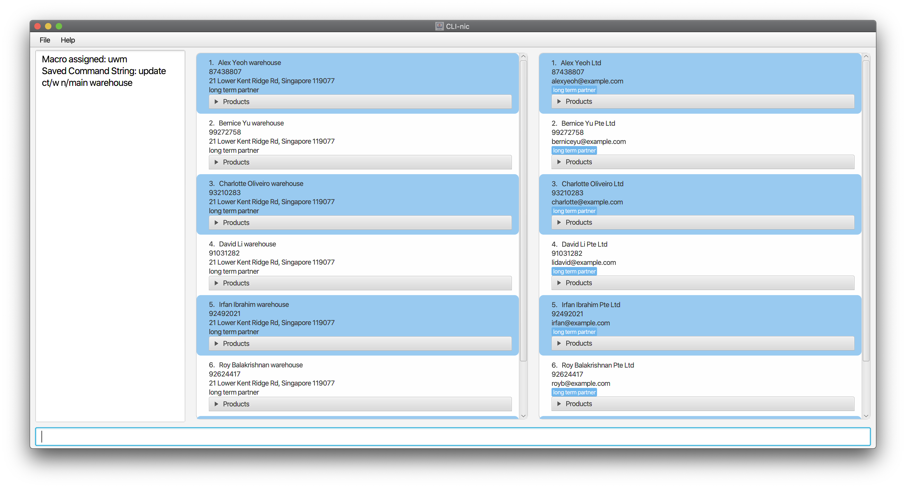

CLI-nic is **an application to help medical supply managers keep track of medical products and storage.** It is
optimized for these managers to **update product supply conditions and access critical product information quickly**
via fast typing and efficient Graphical User Interface interaction.

* Table of Contents
{:toc}

--------------------------------------------------------------------------------------------------------------------

## Quick start

1. Ensure you have Java `11` or above installed in your Computer.

1. Download the latest `CLI-nic.jar` from [here](https://github.com/AY2021S1-CS2103-W14-4/tp/releases).

1. Copy the file to the folder you want to use as the _home folder_ for your CLI-nic system.

1. Double-click the file to start the app. The GUI similar to the below should appear in a few seconds.
Note how the app contains some sample data. 
   

1. Type the command in the command box and press Enter to execute it. e.g. typing **`help`** and pressing Enter will
display instructions for the various commands. Typing **`help delete`** and pressing Enter will display in-depth
instructions for the **`delete`** command. Here are some sample commands to try:

   * **`add`** `ct/w n/warehouseA p/00000000 addr/John street, block 123, #01-01 r/First warehouse` : Adds a
    warehouse named `warehouseA` located at `John street, block 123, #01-01` to CLI-nic. This warehouse is the
    `First warehouse`.

   * **`add`** `ct/s n/Philips Pharmaceutical p/00000000 e/philipsPharm@gmail.com r/Largest contractor` : Adds a
    supplier named `Philips Pharmaceutical` with the phone number `00000000` and email `philipsPharm@gmail.com` to
    CLI-nic. This supplier is the `Largest contractor`.

   * **`assignmacro`** `a/uwm cs/update ct/w n/main warehouse` : Assigns a macro that pairs the alias `uwm` to the
   command string `update ct/w n/main warehouse`.

   * **`clear`** : Deletes all suppliers and warehouses entries in CLI-nic.

   * **`delete`** `ct/s i/12` : Deletes the supplier at index 12 from the list of suppliers.

   * **`edit`** `ct/s i/1 n/Alice p/68574214` : Edits the name and phone number of the supplier at index 1 in
   the list of suppliers to be `Alice` and `685742141`.

   * **`exit`** : Exits the app.

   * **`find`** `ct/w pd/panadol` : Displays all the warehouses that has a product named `panadol`.

   * **`list`**: Displays all the suppliers and warehouses in CLI-nic.

   * **`removemacro`** `uwm` : Removes the macro with the alias `uwm`.

   * **`update`** `ct/w n/WarehouseA pd/Panadol q/10 t/Fever` : Updates the quantity of `Panadol` in `WarehouseA` to
   `10`, and assigns the tag of `Fever` to the product.

   * **`view`** `ct/w i/3` : Displays all the information associated with the warehouse at index 3 of warehouse list
   such as the name, address, phone number, products stored in the warehouse etc.

1. Refer to the [Features](#features) section below for more details of each command.

--------------------------------------------------------------------------------------------------------------------

## Features

**:information_source: Notes about the command format:** 

* Words in `UPPER_CASE` are the parameters to be supplied by the user. 
  e.g. in `delete ct/TYPE i/INDEX`, `TYPE` and `INDEX` are parameters which can be used as `delete ct/w i/1`.

* Items in square brackets are optional 
  e.g. `add ct/TYPE n/NAME p/PHONE e/EMAIL [r/REMARK]` can be used as `add ct/s n
  /Philips Pharmaceutical p/00000000 e/philipsPharm@gmail.com r/fast reply` or as `add ct/s n/Philips
  Pharmaceutical p/00000000 e/philipsPharm@gmail.com`. The latter command is equivalent to `add ct/s n/Philips
  Pharmaceutical p/00000000 e/philipsPharm@gmail.com r/`.

* Items with `…`​ after them can be used multiple times. 
  e.g. `[pd/PRODUCT_NAME…​]` can be used as `pd/panadol`, `pd/panadol needle syringe` and so on. Note that only
  **one prefix is used with multiple keywords** if necessary. As such, the format
  `pd/panadol pd/needle pd/syringe` where multiple prefixes are used is incorrect.

* Parameters can be in any order. 
  e.g. if the command specifies `n/NAME p/PHONE`, `p/PHONE n/NAME` is also acceptable.

* If multiple arguments with the same prefix are present in the input, and if all the values are valid, only the last
  prefix value is chosen.  
  e.g. if a user enters `n/Alice n/Bob` where both `Alice` and `Bob` are valid, no error will be thrown. Instead, the
  name `Bob` will be used instead of `Alice`.

* Usage of irrelevant prefixes or forward slashes `/` are not allowed by default except when user chooses to
  define it in their assigned Macro commands
  e.g. `delete ct/TYPE i/INDEX pd/PRODUCT_NAME` can be used as `delete ct/pw i/1 pd/Panadol` but not
  `delete ct/pw i/1 pd/Panadol r/Fast relief` nor `delete ct/pw i/1 pd/Panadol/Panadol Strong`.

### Viewing help : `help`

Displays a list of available commands and their utility descriptions.
Narrows down to a specific command and its input format and sample commands if specified.
The link to the user guide can also be accessed by pressing F1. Note that an active Internet connection is needed to
view the user guide.

Format: `help [COMMAND]`

Examples:

* `help` : Displays a list of available commands and their description.
* `help add` : Displays the detailed description, input format and sample commands for the `add` command.

### Adding a supplier/warehouse : `add`

Adds a supplier/warehouse to the CLI-nic application.

Format: `add ct/TYPE n/NAME p/PHONE [e/EMAIL] [addr/ADDRESS] [r/REMARK]`

* `TYPE` specified should be either `s` for supplier or `w` for warehouse.
* Note that a warehouse cannot have an `EMAIL` and a supplier cannot have an `ADDRESS`.
* Although `EMAIL` and `ADDRESS` are marked as optional parameters, either one of these parameters must be present
  in the input.
* When adding a supplier, `EMAIL` must be present but `ADDRESS` must not.
* When adding a warehouse, `ADDRESS` must be present but `EMAIL` must not.
* `NAME` should start with an alphanumeric character.
* `PHONE` should not have a spacing in between. `p/98761234` is allowed, but `p/9876 1234` is not allowed.
   Only numbers are allowed.
* `EMAIL` should be a valid email address.
* `ADDRESS` should be a valid address.

Examples:
* `add ct/s n/Philips Pharmaceutical p/00000000 e/philipsPharm@gmail.com r/Largest contractor`:
  Adds a supplier named `Philips Pharmaceutical` with the phone number `00000000` and email `philipsPharm@gmail.com`.
  This supplier is the `Largest contractor`.
* `add ct/w n/WarehouseA p/00000000 addr/John street, block 123, #01-01 r/First warehouse` : Adds a warehouse
  named `WarehouseA` located at `John street, block 123, #01-01` with the phone number `00000000`. This warehouse is
  the `First warehouse`.

### Assigning macro to selected command string: `assignmacro`

Assigns a macro that pairs the specified alias to the specified command string.

Format:	`assignmacro a/ALIAS cs/COMMAND_STRING`

* `alias` cannot be an existing command word such as `add`, `delete` etc.
* `alias` cannot be already used in an existing macro.
* `alias` should only consist of alphanumeric characters and/or underscores.
* `COMMAND_STRING` can consist of any number of prefixes, but the first word has to be a pre-defined command word.

Example:

* `assignmacro a/uwm cs/update ct/w n/main warehouse` : Assigns a macro that pairs the alias `uwm` to the command string
  `update ct/w n/main warehouse`.

### Clearing all entries : `clear`

Deletes all suppliers and warehouses entries in CLI-nic.

Format: `clear`

### Deleting a particular supplier or warehouse : `delete`

Deletes a particular supplier or warehouse entry that is not needed anymore.

Format: `delete ct/TYPE i/INDEX`

* `TYPE` specified should be either `s` for supplier or `w` for warehouse.
* `INDEX` must be a positive integer, not exceeding the total length of the displayed list.

Examples:

* `delete ct/s i/12` : Removes the supplier at index 12 of the list of suppliers.
* `delete ct/w i/1` : Removes the warehouse at index 1 of the list of warehouses.

### Deleting a product in a supplier or warehouse : `delete`

Deletes a product entry no longer sold by a specific supplier or stored by a specific warehouse.

Format: `delete ct/TYPE i/INDEX pd/PRODUCT_NAME`

* `TYPE` specified should be either `ps` for products in supplier or `pw` for products in warehouse.
* `INDEX` must be a positive integer, not exceeding the total length of the displayed list.
* `PRODUCT_NAME` must be an identifiable full name of the product, and it must start with an alphanumeric character.
* `PRODUCT_NAME` is case-insensitive.
* `PRODUCT_NAME` must exist in the current supplier or warehouse before it can be deleted.

Examples:

* `delete ct/pw i/1 pd/Panadol` : Removes the `Panadol` product from the warehouse at index 1 of the list of warehouses.
* `delete ct/ps i/12 pd/Aspirin` : Removes the `Aspirin` product from the supplier at index 12 of the list of suppliers.

**:information_source: Note:** The prefix `pd/` will be not be allowed when the `ct/` given is `s` (supplier) or `w` (warehouse).

### Editing a supplier or warehouse : `edit`

Edits a supplier or warehouse at specified index.
For suppliers, only its name, phone, email and remarks can be edited.
For warehouses, only its name, phone, address and remark can be edited.
Note that no two suppliers or warehouses can share the same name in CLI-nic.

Format: `edit ct/TYPE i/INDEX [n/NAME] [p/PHONE] [r/REMARK] [addr/ADDRESS] [e/EMAIL]`

* Note that `EMAIL` can only be used for suppliers while `ADDRESS` can only be used for warehouses.
* At least one of the optional parameters have to be specified in the input.
* Edited supplier or warehouse must be different from one started with.
* `TYPE` specified should be either `s` for supplier or `w` for warehouse.

Examples:

* `edit ct/s i/1 n/Alice p/85236417 r/Largest supplier e/alicekoh@example.com` : Edits the name, phone, remark and email
  of the first supplier in the list of suppliers to be `Alice`, `85236417`, `Largest supplier` and
  `alicekoh@example.com`.
* `edit ct/w i/2 n/Bob p/67851234 r/Largest warehouse addr/Jurong Street 11` : Edits the name, phone, remark and
  address of the second warehouse in the list of warehouses to be `Bob`, `67851234`, `Largest warehouse`
  and `Jurong Street 11`.

### Exiting the program : `exit`

Exits the program.

Format: `exit`

### Finding relevant supplier(s) or warehouse(s): `find`

Finds all supplier(s) or warehouse(s) whose name, remark and/or products sold/stored matches the provided keywords.

Format: `find ct/TYPE [n/NAME…​] [pd/PRODUCT_NAME…​] [r/REMARK…​]`

* `NAME`, `PRODUCT_NAME` and `REMARK` are case-insensitive.
* Note that only full words will be matched. `needle` will match `needle` but not `needles`.
* `TYPE` specified should be either `s` for supplier or `w` for warehouse.
* Any combination of the `NAME`, `PRODUCT_NAME` and `REMARK` parameters can be provided but at least one of the
  parameters with its corresponding prefix must be specified.

Examples:

* `find ct/s pd/masks` : Displays all the suppliers that sell `masks`.
* `find ct/w pd/panadol r/biggest` : Displays the warehouse(s) that stores products with names matching
  `panadol` or with remark matching `biggest`.

### Listing all suppliers and warehouses entries : `list`

Lists all suppliers and warehouses' entries in CLI-nic.

Format: `list`

### Removing macro: `removemacro`

Removes the macro with the specified alias.

Format:	`removemacro ALIAS`

* `ALIAS` specified must exist to be deleted.

Example:

* `removemacro uwm` : Removes the macro with the alias `uwm`.

### Saving the data

CLI-nic data are saved in the hard disk automatically after any command that changes the data.
There is no need to save manually.

### Updating the quantity and/or tags of a product for a supplier or warehouse: `update`

Updates the quantity and/or tags of the product with the specified name in the specified supplier or warehouse.
If the product does not exist for that supplier or warehouse, a new product will be created for that supplier
or warehouse.

Format:	`update ct/TYPE n/NAME pd/PRODUCT_NAME [q/QUANTITY] [t/TAG]`

* `TYPE` specified should be either `s` for supplier or `w` for warehouse.
* `NAME` and `PRODUCT_NAME` specified are case-insensitive.
* The supplier or warehouse should currently exist in the CLI-nic application.
* `QUANTITY` should be a non-negative unsigned integer.
* `TAG` should be a single alphanumeric word.
* If the `PRODUCT_NAME` already exists in the supplier or warehouse, at least one optional argument has to be entered.

Example:

* `update ct/w n/WarehouseA pd/Panadol q/10 t/fever` : Updates the quantity of `Panadol` in `WarehouseA` to `10`
  and gives `Panadol` a tag of `fever`.

### Viewing a specific supplier or warehouse: `view`

Shows a specific supplier or warehouse at the specified index with their relevant information e.g. products sold/stored,
phone, remark etc.

Format: `view ct/TYPE i/INDEX`

* `TYPE` specified should be either `s` for supplier or `w` for warehouse.
* `INDEX` must be a positive integer, not exceeding the total length of the supplier/warehouse list.

Examples:

* `view ct/s i/1` : Displays all the information associated with the supplier at index 1 in the supplier list.
* `view ct/w i/2` : Displays all the information associated with the warehouse at index 2 in the warehouse list.

### Undo/Redo a previous editing : `undo`/`redo`

Undo command recovers a previous version of CLI-nic data if any data has been changed.
Redo command restores the data in CLI-nic before an `undo` command was done.

Format: `undo` / `redo`

* Any trailing words behind the command words will be ignored.
* For example: if one types `undo redo`, the command will be to `undo` the editing.

 

--------------------------------------------------------------------------------------------------------------------

## To be implemented in future iterations

### Creating a purchase order : `create`

Creates a purchase order to track the purchase of products from a supplier to a warehouse.

Format: `create s/SUPPLIER_NAME w/WAREHOUSE_NAME pd/PRODUCT_NAME…​ q/QUANTITY…​ date/EXPECTED_DELIVERY_DATE`

* `SUPPLIER_NAME`, `WAREHOUSE_NAME` and `PRODUCT_NAME` must be identifiable.
* The number of arguments specified for `QUANTITY` and `PRODUCT_NAME` must match.
* `EXPECTED_DELIVERY_DATE` must be after current time and of the form YYYY-MM-DD.

Examples:

* `create s/SupplierA w/WarehouseA pd/Panadol1 Panadol2 q/100 200 date/2020-12-12` : Creates a purchase order for the
delivery of `100` `Panadol1` and `200` `Panadol2` from `SupplierA` to `WarehouseA` by `December 12, 2020`.

--------------------------------------------------------------------------------------------------------------------

## FAQ

**Q**: How do I transfer my data to another computer? 
**A**: Install the app in the other computer and overwrite the empty data file it creates with the file that contains
the data of your previous CLI-nic home folder.

--------------------------------------------------------------------------------------------------------------------

## Command summary

Action | Format | Example
-------|--------|--------
**Add** Supplier | `add ct/s n/NAME p/PHONE e/EMAIL [r/REMARK]` | `add ct/s n/Philips Pharmaceutical p/00000000 e/philipsPharm@gmail.com r/Largest contractor`
**Add** Warehouse | `add ct/w n/NAME p/PHONE addr/ADDRESS [r/REMARK]` | `add ct/w n/warehouseA p/00000000 addr/John street, block 123, #01-01 r/First warehouse`
**Assign Macro** | `assignmacro a/ALIAS cs/COMMAND_STRING` | `assignmacro a/uwm cs/update ct/w n/main warehouse`
**Clear** | `clear`
**Delete** | `delete ct/TYPE i/INDEX` | `delete ct/w i/1`
**Delete** Product| `delete ct/TYPE i/INDEX pd/PRODUCT_NAME` | `delete ct/pw i/1 pd/Panadol`
**Edit** | `edit ct/TYPE i/INDEX [n/NAME] [p/PHONE] [r/REMARK] [addr/ADDRESS] [e/EMAIL]` | `edit ct/w i/1 n/Alice Warehouse p/98765432 r/Second largest warehouse addr/21 Lower Kent Ridge Rd`
**Exit** | `exit`
**Find** | `find ct/TYPE [n/NAME…​] [pd/PRODUCT_NAME…​] [r/REMARK…​]` | `find ct/w pd/panadol face mask needle`
**Help** | `help [COMMAND]` | `help add`
**List** | `list`
**Remove Macro** | `removemacro ALIAS` | `removemacro uwm`
**Update** | `update ct/TYPE n/NAME pd/PRODUCT_NAME [q/QUANTITY] [t/TAG…​]` | `update ct/w n/WarehouseA pd/Panadol q/10 t/fever`
**View** | `view ct/TYPE i/INDEX` | `view ct/s i/1`
**Undo** | `undo`
**Redo** | `redo`
