CLI-nic is **an application to help medical supply managers keep track of medical products and storage.** It is
optimized for these managers to **update product supply conditions and access critical product information quickly**
via fast typing and efficient Graphical User Interface interaction.

* Table of Contents
{:toc}

--------------------------------------------------------------------------------------------------------------------

## Quick start

1. Ensure you have Java `11` or above installed in your Computer.

1. Download the latest `CLI-nic.jar` from [here](https://github.com/AY2021S1-CS2103-W14-4/tp/releases).

1. Copy the file to the folder you want to use as the _home folder_ for your CLI-nic system.

1. Double-click the file to start the app. The GUI similar to the below should appear in a few seconds.
Note how the app contains some sample data. 
  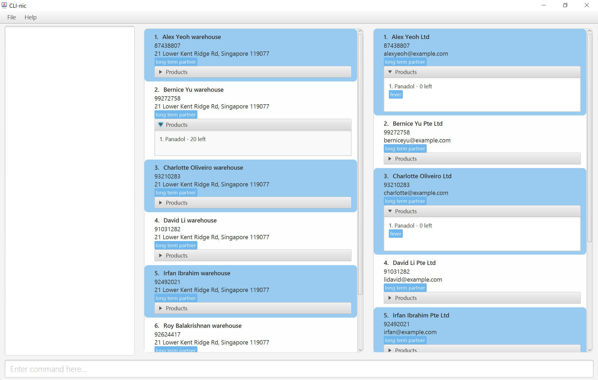

1. Type the command in the command box and press Enter to execute it. e.g. typing `help` and pressing Enter will
display instructions for the various commands. Typing `help delete` and pressing Enter will display in-depth
instructions for the `delete` command. Here are some sample commands to try:

   * **`add`** `ct/w n/warehouseA p/00000000 addr/John street, block 123, #01-01 r/First warehouse` : Adds a
    warehouse named `warehouseA` located at `John street, block 123, #01-01` to CLI-nic. This warehouse is the
    `First warehouse`.

   * **`add`** `ct/s n/Philips Pharmaceutical p/00000000 e/philipsPharm@gmail.com r/Largest contractor` : Adds a
    supplier named `Philips Pharmaceutical` with the phone number `00000000` and email `philipsPharm@gmail.com` to
    CLI-nic. This supplier is the `Largest contractor`.

   * **`assignmacro`** `a/findsup cs/find ct/s pd/panadol` : Assigns a macro that pairs the alias `findsup` to the
   command string `find ct/s pd/panadol`.

   * **`clear`** : Deletes all suppliers and warehouses entries in CLI-nic.

   * **`delete`** `ct/s i/3` : Deletes the supplier at index 3 from the list of displayed suppliers in the GUI.

   * **`edit`** `ct/s i/1 n/Alice p/68574214` : Edits the name and phone number of the supplier at index 1 from
   the list of displayed suppliers in the GUI to be `Alice` and `685742141`.

   * **`exit`** : Exits the app.

   * **`find`** `ct/w pd/panadol` : Displays all warehouse(s) that has a product named `panadol`.

   * **`list`**: Displays all the suppliers and warehouses in CLI-nic.

   * **`listmacro`**: Displays all the macros saved in CLI-nic.
   
   * **`redo`**: Restores the data in CLI-nic before an `undo` command was executed.

   * **`removemacro`** `findsup` : Removes the macro with the alias `findsup`.
   
   * **`undo`**: Recovers the previous version of CLI-nic data.

   * **`update`** `ct/w i/2 pd/Panadol q/10 t/Fever` : Updates the quantity of `Panadol` stored in the warehouse at
   index 2 from the list of displayed warehouses in the GUI to `10` and assigns the tag of `Fever` to the product.

   * **`view`** `ct/w i/3` : Displays all the information associated with the warehouse at index 3 from the list of
   displayed warehouses in the GUI such as the name, address, phone number, products stored in the warehouse etc.

1. Refer to the [Features](#features) section below for more details of each command.

--------------------------------------------------------------------------------------------------------------------

## Features

**:information_source: Notes about the command format:** 

* Words in `UPPER_CASE` are the parameters to be supplied by the user. 
  e.g. in `delete ct/TYPE i/INDEX`, `TYPE` and `INDEX` are parameters which can be used as `delete ct/w i/1`.

* Items in square brackets are optional 
  e.g. `add ct/s n/NAME p/PHONE e/EMAIL [r/REMARK]` can be used as:
  * `add ct/s n/Philips Pharmaceutical p/00000000 e/philipsPharm@gmail.com r/fast reply` or as
  * `add ct/s n/Philips Pharmaceutical p/00000000 e/philipsPharm@gmail.com`. 

* Items with `…`​ after them can be used multiple times. 
  * e.g. `[pd/PRODUCT_NAME…​]` can be used as `pd/panadol`, `pd/panadol needle syringe` and so on.
  * Note that only **one prefix is used with multiple keywords** if necessary. 

* Parameters can be in any order. 
  e.g. if the command specifies `n/NAME p/PHONE`, `p/PHONE n/NAME` is also acceptable.

* If multiple arguments with the same prefix are present in the input, and if all the values are valid, only the last
  prefix value is chosen.  
  e.g. if a user enters `n/Alice n/Bob` where both `Alice` and `Bob` are valid, no error will be thrown. Instead, the
  name `Bob` will be used instead of `Alice`.

* Usage of irrelevant prefixes or forward slashes `/` are not allowed by default except when the user chooses to
  define it in their assigned Macro commands. 
  e.g. `delete ct/TYPE i/INDEX pd/PRODUCT_NAME` can be used as `delete ct/pw i/1 pd/Panadol` but not
  `delete ct/pw i/1 pd/Panadol r/Fast relief` nor `delete ct/pw i/1 pd/Panadol/Panadol Strong`.
  
* For single word commands that do not take in arguments such as `clear`, `list`, `redo` and `undo`, trailing keywords
  after the command word will be ignored.

### Viewing help : `help`

Displays a list of available commands and their utility descriptions.
Narrows down to a specific command and its input format and sample commands if specified.
The link to the user guide can also be accessed by pressing F1. Note that an active Internet connection is needed to
view the user guide.

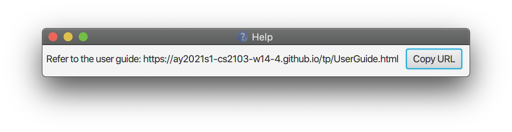

Format: `help [COMMAND]`

Examples:

* `help` : Displays a list of available commands and their descriptions.
  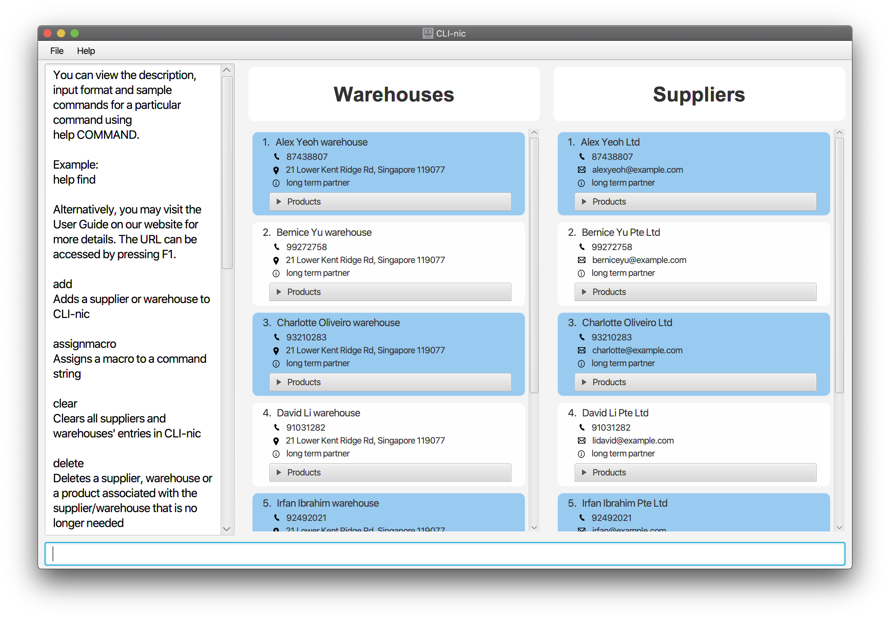
* `help add` : Displays the detailed description, input format and sample commands for the `add` command.
  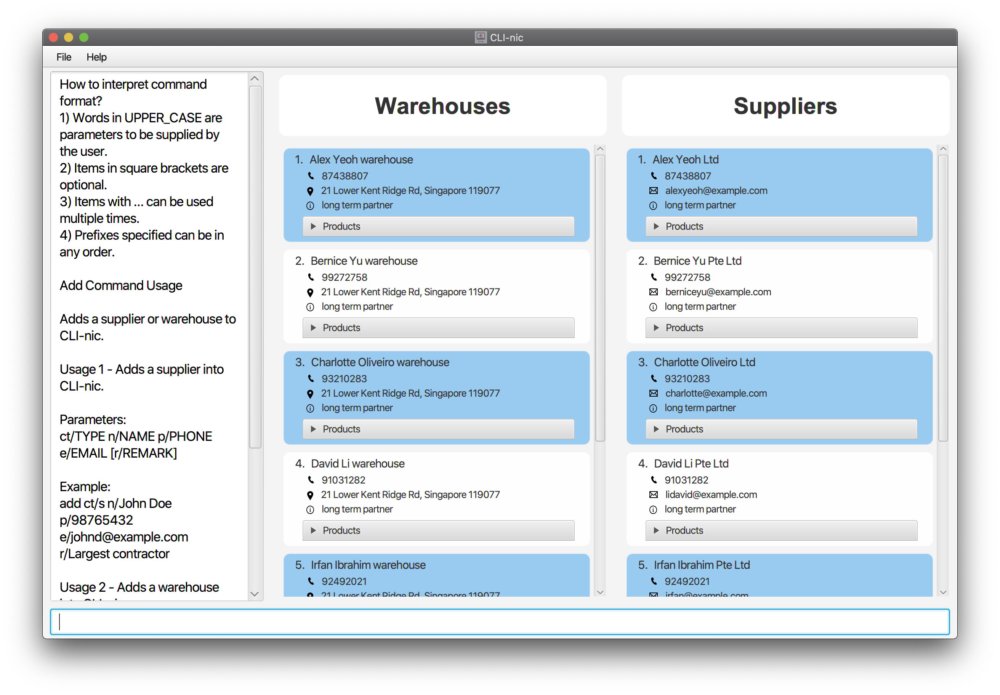

### Accessing command history

Accesses valid commands that have been previously used. 
Use the &#8593; and &#8595; keys on the keyboard to iterate through the command history.
Note that all valid commands will be stored in the command history, including duplicates.

### Adding a supplier : `add`

Adds a supplier to the CLI-nic application.

Format: `add ct/s n/NAME p/PHONE e/EMAIL [r/REMARK]`

* `NAME` should start with an alphanumeric character.
* `PHONE` should not have a spacing in between. `p/98761234` is allowed, but `p/9876 1234` is not allowed.
   Only numbers are allowed.
* To add a product to a supplier, refer to the
  [update supplier](#updating-the-quantity-andor-tags-of-a-product-sold-by-a-supplier-update) section for more
  details.

Example:
* `add ct/s n/Philips Pharmaceutical p/00000000 e/philipsPharm@gmail.com r/Largest contractor` : Adds a supplier
  named `Philips Pharmaceutical` with the phone number `00000000` and email `philipsPharm@gmail.com`.
  This supplier is the `Largest contractor`.
  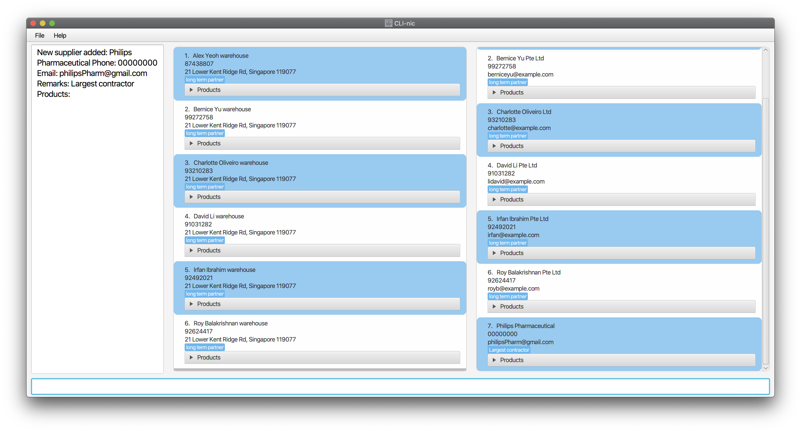

### Adding a warehouse : `add`

Adds a warehouse to the CLI-nic application.

Format: `add ct/w n/NAME p/PHONE addr/ADDRESS [r/REMARK]`

* `NAME` should start with an alphanumeric character.
* `PHONE` should not have a spacing in between. `p/98761234` is allowed, but `p/9876 1234` is not allowed.
   Only numbers are allowed.
* To add a product to a warehouse, refer to the
  [update warehouse](#updating-the-quantity-andor-tags-of-a-product-stored-in-a-warehouse-update) section for more
  details.

Example:
* `add ct/w n/WarehouseA p/00000000 addr/John street, block 123, #01-01 r/First warehouse` : Adds a warehouse
  named `WarehouseA` located at `John street, block 123, #01-01` with the phone number `00000000`. This warehouse is
  the `First warehouse`.
  

### Assigning macro to selected command string: `assignmacro`

Assigns a macro that pairs the specified alias to the specified command string.
This is especially useful for running commands that need to be used frequently.
By assigning a command string to an alias, users can enter the alias keyword instead of the command string to run
the same command (along with any additional prefixes supplied).

Format:	`assignmacro a/ALIAS cs/COMMAND_STRING`

* `ALIAS` cannot be an existing command word such as `add`, `delete` etc.
* `ALIAS` cannot be already used for an existing macro.
* `ALIAS` should only consist of alphanumeric characters and/or underscores (case-sensitive).
* `COMMAND_STRING` can consist of any number of prefixes (can be a partial command), but the first word has to be a pre-defined command word.
* `COMMAND_STRING` cannot take in another `assignmacro` command e.g.
  `assignmacro a/asgmac cs/assignmacro a/asgmac ...` as this is recursive.
* Even if the macro is valid, running the macro does not guarantee a valid command.

Examples:

* `assignmacro a/findsup cs/find ct/s pd/panadol` : Assigns a macro that pairs the alias `findsup` to the command
  string `find ct/s pd/panadol`. With this macro set up, users can now enter `findsup` instead of
  `find ct/s pd/panadol` to find the relevant supplier(s).
  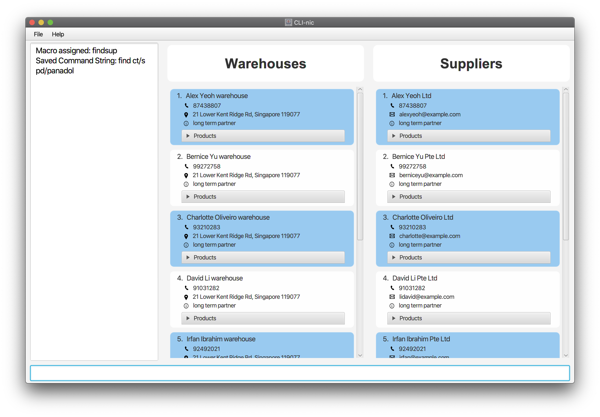

* `assignmacro a/uwp cs/update ct/w pd/panadol t/fever` : Assigns a macro that pairs the alias `uwp` to the
  command string `update ct/w pd/panadol t/fever`. Note that this is just a partial command string.
  With this macro set up, users can now enter `uwp i/1 q/123` instead of
  `update ct/w i/1 pd/panadol q/123 t/fever` to update the quantity for the `Panadol` product under the
  first warehouse from the list of displayed warehouses in the GUI to `123`.

### Autocomplete

Helps users complete their commands faster with the compulsory prefixes.

Users will be able to see a list of autocomplete options which is constantly updated while typing.
Once the autocomplete context menu is displayed, users can use the arrow keys to choose the option that they desire
and upon pressing Enter, they will be able to select the autocomplete option.

Example:

* User enters "add" in the command box and a list of autocomplete options is displayed.
  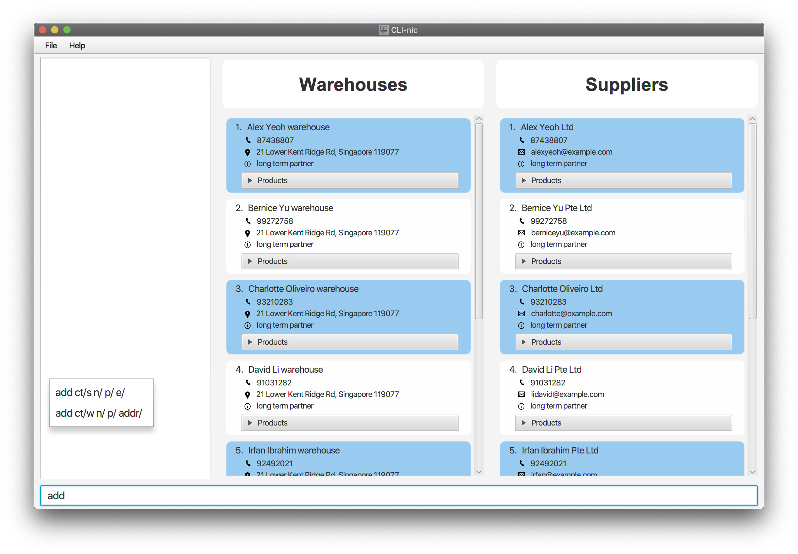

### Clearing all entries : `clear`

Deletes all suppliers and warehouses entries in CLI-nic.

Format: `clear`

### Deleting a supplier : `delete`

Deletes a supplier that is not needed anymore.

Format: `delete ct/s i/INDEX`

* `INDEX` must be a positive integer, not exceeding the total length of the displayed supplier list in the GUI.

Example:

* `delete ct/s i/1` : Removes the supplier at index 1 in the list of displayed suppliers in the GUI.
  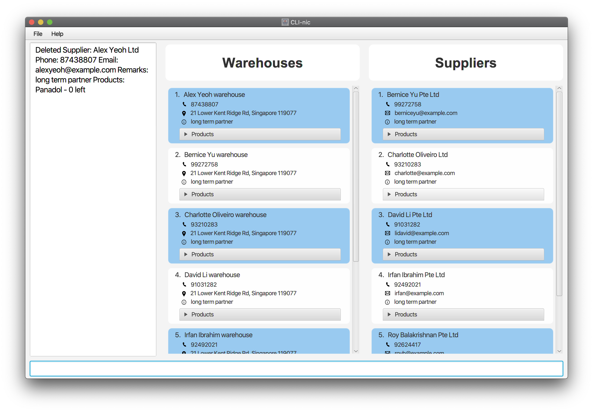

### Deleting a warehouse : `delete`

Deletes a warehouse that is not needed anymore.

Format: `delete ct/w i/INDEX`

* `INDEX` must be a positive integer, not exceeding the total length of the displayed warehouse list in the GUI.

Example:

* `delete ct/w i/1` : Removes the warehouse at index 1 in the list of displayed warehouses in the GUI.
  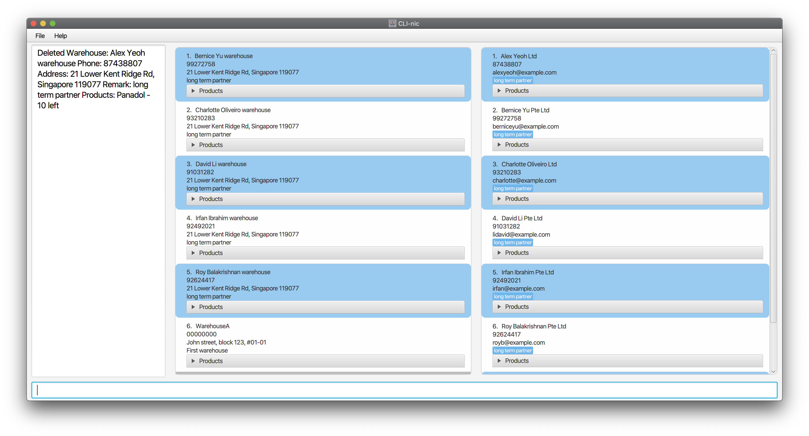

### Deleting a product sold by a supplier : `delete`

Deletes a product entry no longer sold by a specific supplier.

Format: `delete ct/ps i/INDEX pd/PRODUCT_NAME`

* `INDEX` must be a positive integer, not exceeding the total length of the displayed supplier list in the GUI.
* `PRODUCT_NAME` must be an identifiable full name of the product, and it must start with an alphanumeric character.
* `PRODUCT_NAME` is case-insensitive.
* `PRODUCT_NAME` must exist in the current supplier before it can be deleted.

Example:

* `delete ct/ps i/3 pd/Panadol` : Removes the `Panadol` product sold by the supplier at index 3 of the list of
  displayed suppliers in the GUI.
  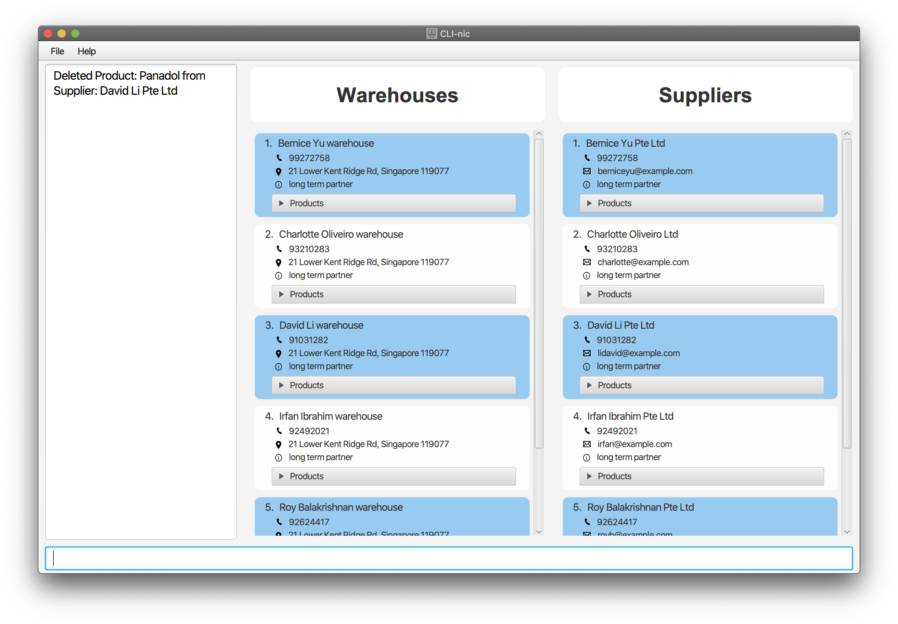

### Deleting a product stored in a warehouse : `delete`

Deletes a product entry no longer stored in a specific warehouse.

Format: `delete ct/pw i/INDEX pd/PRODUCT_NAME`

* `INDEX` must be a positive integer, not exceeding the total length of the displayed warehouse list in the GUI.
* `PRODUCT_NAME` must be an identifiable full name of the product, and it must start with an alphanumeric character.
* `PRODUCT_NAME` is case-insensitive.
* `PRODUCT_NAME` must exist in the current warehouse before it can be deleted.

Example:

* `delete ct/pw i/1 pd/Panadol` : Removes the `Panadol` product stored in the warehouse at index 1 of the list of
  displayed warehouses in the GUI.
  

**:information_source: Note:** The prefix `pd/` will not be allowed when the `ct/` given is `s` (supplier) or `w` (warehouse).

### Editing a supplier : `edit`

Edits a supplier at the specified index (based on the displayed supplier list shown in the GUI).
Only its name, phone, email and remark can be edited.
Note that no two suppliers can share the same name in CLI-nic.

Format: `edit ct/s i/INDEX [n/NAME] [p/PHONE] [e/EMAIL] [r/REMARK]`

* At least one of the optional parameters have to be specified in the input.
* Edited supplier must be different from the one started with.

Example:

* `edit ct/s i/1 n/Alice p/85236417 e/alicekoh@example.com r/Largest supplier` : Edits the name, phone, email and remark
  of the first supplier in the list of displayed suppliers in the GUI to be `Alice`, `85236417`, `alicekoh@example.com`
  and `Largest supplier`.
  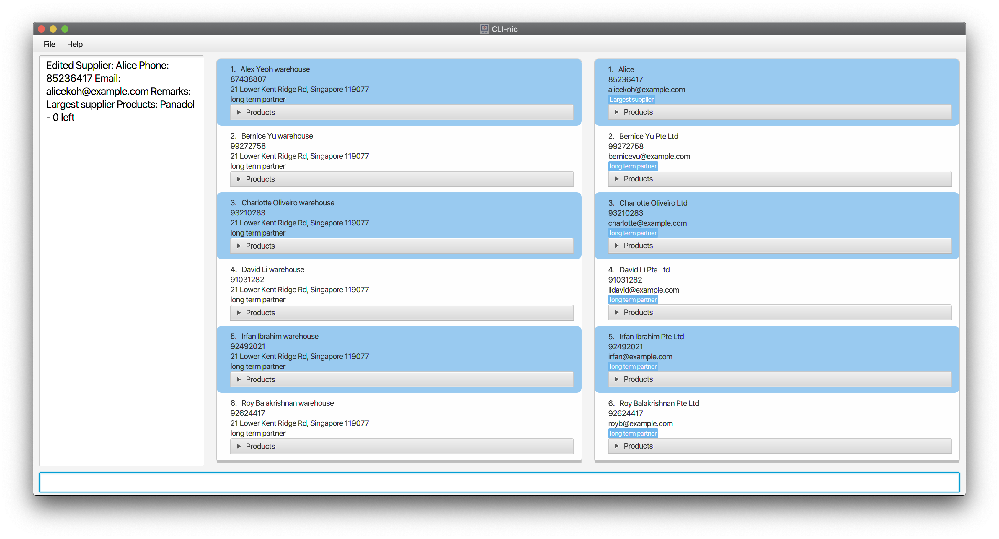

### Editing a warehouse : `edit`

Edits a warehouse at the specified index (based on the displayed warehouse list shown in the GUI).
Only its name, phone, address and remark can be edited.
Note that no two warehouses can share the same name in CLI-nic.

Format: `edit ct/w i/INDEX [n/NAME] [p/PHONE] [addr/ADDRESS] [r/REMARK]`

* At least one of the optional parameters have to be specified in the input.
* Edited warehouse must be different from the one started with.

Example:

* `edit ct/w i/2 n/Bob p/67851234 addr/Jurong Street 11 r/Largest warehouse` : Edits the name, phone, address and
  remark of the second warehouse in the list of displayed warehouses in the GUI to be `Bob`, `67851234`,
  `Jurong Street 11` and `Largest warehouse`.
  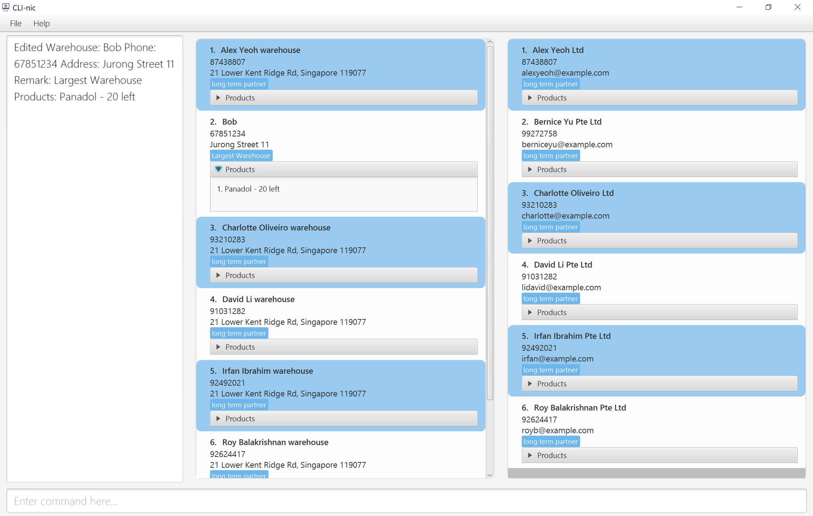

### Exiting the program : `exit`

Exits the program.

Format: `exit`

### Finding relevant supplier(s): `find`

Finds all supplier(s) whose name, remark and/or products sold matches any of the provided keywords.

Format: `find ct/s [n/NAME…​] [pd/PRODUCT_NAME…​] [r/REMARK…​]`

* `NAME`, `PRODUCT_NAME` and `REMARK` are case-insensitive.
* Note that only full words will be matched. `needle` will match `needle` but not `needles`.
* Any combination of the `NAME`, `PRODUCT_NAME` and `REMARK` parameters can be provided but at least one of the
  parameters with its corresponding prefix must be specified.

Example:

* `find ct/s pd/mask` : Displays all the supplier(s) that sell `mask`.
  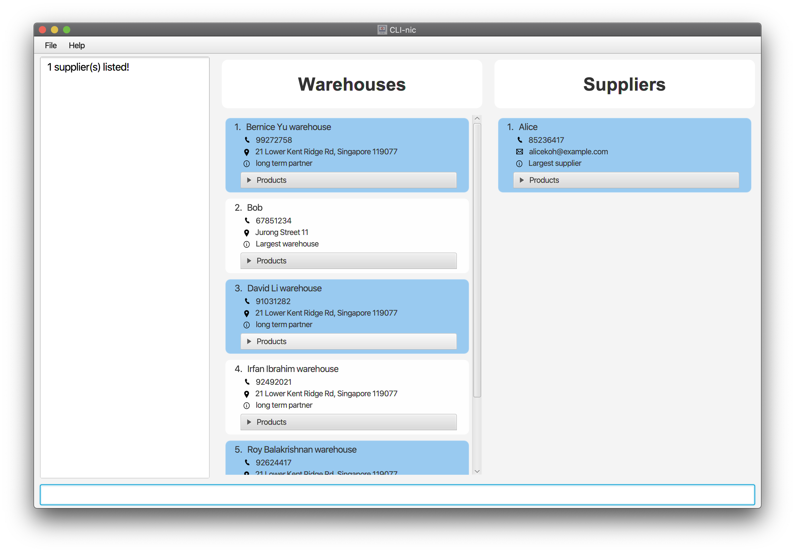

### Finding relevant warehouse(s): `find`

Finds all warehouse(s) whose name, remark and/or products stored matches any of the provided keywords.

Format: `find ct/w [n/NAME…​] [pd/PRODUCT_NAME…​] [r/REMARK…​]`

* `NAME`, `PRODUCT_NAME` and `REMARK` are case-insensitive.
* Note that only full words will be matched. `needle` will match `needle` but not `needles`.
* Any combination of the `NAME`, `PRODUCT_NAME` and `REMARK` parameters can be provided but at least one of the
  parameters with its corresponding prefix must be specified.

Example:

* `find ct/w pd/panadol r/biggest` : Displays all the warehouse(s) that stores products with names matching
  `panadol` or with remark matching `biggest`.
  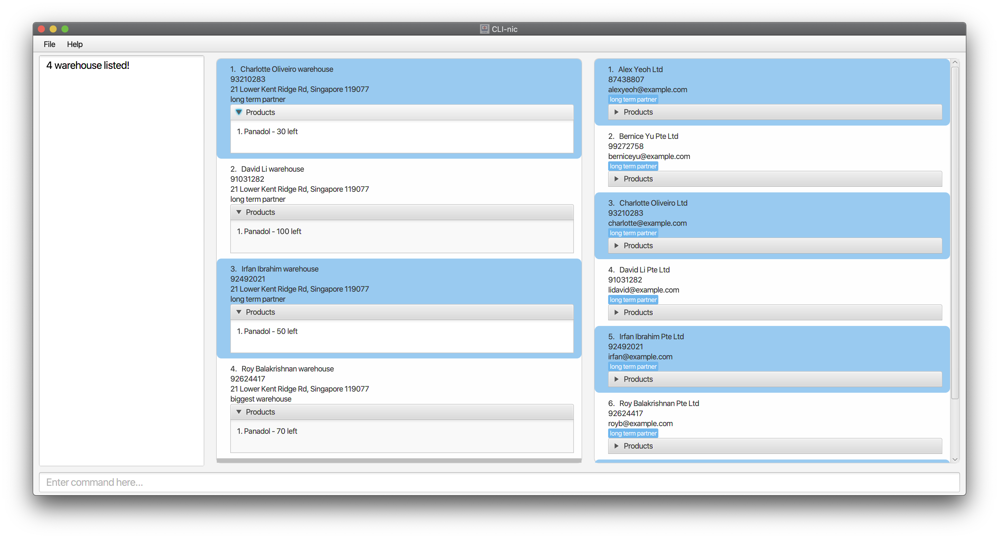

### Listing all macros : `listmacro`

Lists all saved macros in CLI-nic.

Format: `listmacro`

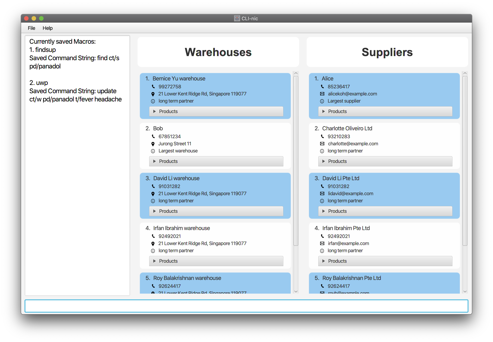

### Listing all suppliers and warehouses entries : `list`

Lists all suppliers and warehouses' entries in CLI-nic.

Format: `list`

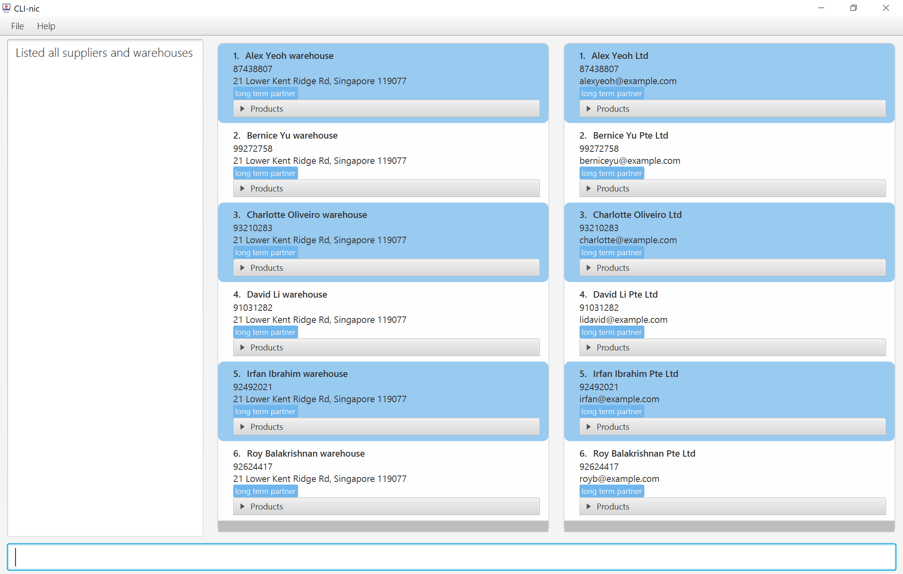

### Redoing : `redo`

Restores the data in CLI-nic to the version before an `undo` command was done.

Format: `redo`

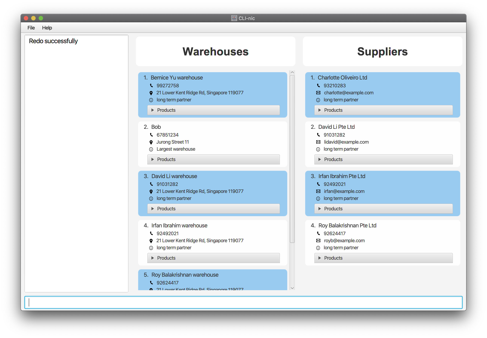

**:information_source: Note:** `assignmacro` and `removemacro` do not modify CLI-nic data directly, and hence are not
redoable.

### Removing macro: `removemacro`

Removes the macro with the specified alias.

Format:	`removemacro ALIAS`

* `ALIAS` specified must exist to be deleted.
* `ALIAS` is case-sensitive.

Example:

* `removemacro findsup` : Removes the macro with the alias `findsup`.

### Saving the data

CLI-nic data are saved in the hard disk automatically after any command that changes the data.
There is no need to save manually.

### Undoing : `undo`

Recovers a previous version of CLI-nic data if data has been changed.

Format: `undo`

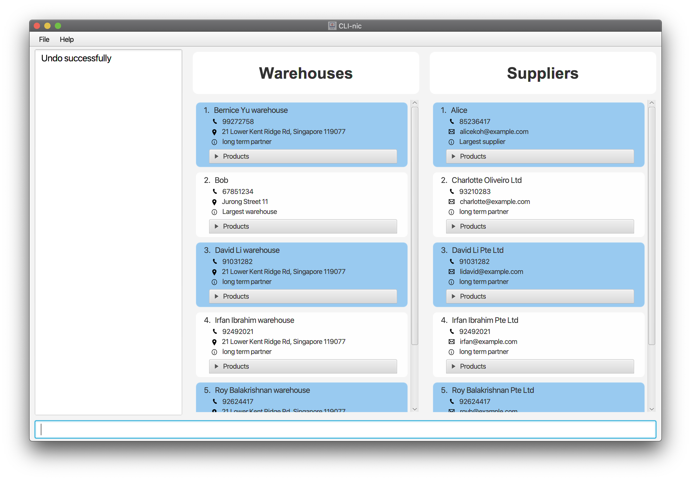

**:information_source: Note:** `assignmacro` and `removemacro` do not modify CLI-nic data directly, and hence are not
undoable.

### Updating the quantity and/or tags of a product sold by a supplier: `update`

Updates the quantity and/or tags of the product with the specified name at the specified supplier index.
If the product does not exist, a new product will be created for that supplier.

Format:	`update ct/s i/INDEX pd/PRODUCT_NAME [q/QUANTITY] [t/TAG…​]`

* `INDEX` must be a positive integer, not exceeding the total length of the displayed supplier list in the GUI.
* `PRODUCT_NAME` specified is case-insensitive.
* `QUANTITY` should be a non-negative unsigned integer.
* `TAG` should be alphanumeric. Multiple keyword tags can be supplied under the same prefix.
* If `PRODUCT_NAME` already exists in the supplier, at least one optional argument has to be entered.
* Note that the name of the product cannot be updated.

Example:

* `update ct/s i/4 pd/Panadol q/10 t/fever cold` : Updates the quantity of `Panadol` sold by the supplier at index 4
  from the list of displayed suppliers in the GUI to `10` and gives `Panadol` 2 tags: `fever` and `cold`.
  

### Updating the quantity and/or tags of a product stored in a warehouse: `update`

Updates the quantity and/or tags of the product with the specified name at the specified warehouse index.
If the product does not exist, a new product will be created for that warehouse.

Format:	`update ct/w i/INDEX pd/PRODUCT_NAME [q/QUANTITY] [t/TAG…​]`

* `INDEX` must be a positive integer, not exceeding the total length of the displayed supplier list in the GUI.
* `PRODUCT_NAME` specified is case-insensitive.
* `QUANTITY` should be a non-negative unsigned integer.
* `TAG` should be alphanumeric. Multiple keyword tags can be supplied under the same prefix.
* If `PRODUCT_NAME` already exists in the warehouse, at least one optional argument has to be entered.
* Note that the name of the product cannot be updated.

Example:

* `update ct/w i/1 pd/Panadol q/10 t/fever cold` : Updates the quantity of `Panadol` stored in the warehouse at index 1
  from the list of displayed warehouses in the GUI to `10` and gives `Panadol` 2 tags: `fever` and `cold`.
  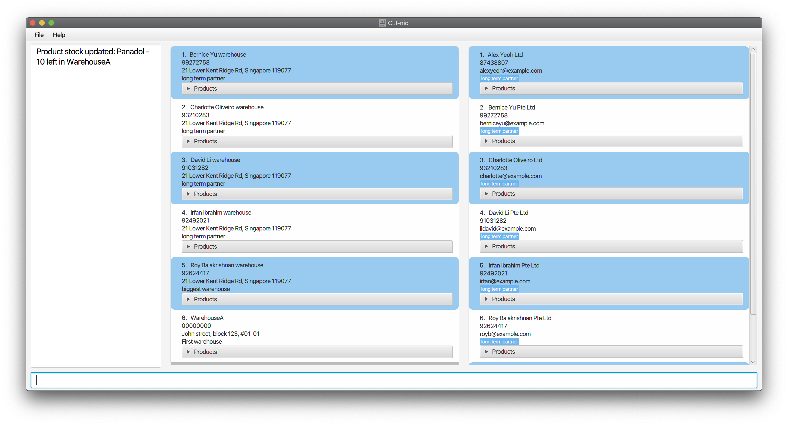

### Viewing a specific supplier: `view`

Shows a specific supplier at the specified index with their relevant information e.g. products sold,
phone, remark etc.

Format: `view ct/s i/INDEX`

* `INDEX` must be a positive integer, not exceeding the total length of the displayed supplier list in the GUI.

Example:

* `view ct/s i/1` : Displays all the information associated with the supplier at index 1 in the supplier list.
  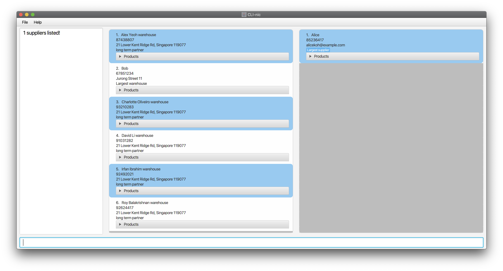

### Viewing a specific warehouse: `view`

Shows a specific warehouse at the specified index with their relevant information e.g. products stored,
phone, remark etc.

Format: `view ct/w i/INDEX`

* `INDEX` must be a positive integer, not exceeding the total length of the displayed warehouse list in the GUI.

Example:

* `view ct/w i/2` : Displays all the information associated with the warehouse at index 2 in the warehouse list.
  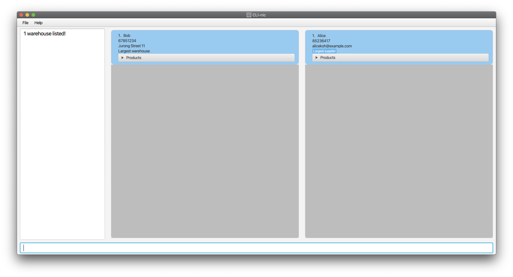
  

:bulb: **Tip:**

The `view` command is optimised for users who prefer to use the keyboard.

Using the `view` command, users can view the products associated with a specific supplier or warehouse without needing
to use the mouse.

Alternatively, users can click on the products pane in the GUI using the mouse to view the products associated.

Users might also find it useful to use the `view` command in conjunction with the `find` command.

 

--------------------------------------------------------------------------------------------------------------------

## To be implemented in future iterations

### Creating a purchase order : `create`

Creates a purchase order to track the purchase of products from a supplier to a warehouse.

Format: `create s/SUPPLIER_NAME w/WAREHOUSE_NAME pd/PRODUCT_NAME…​ q/QUANTITY…​ date/EXPECTED_DELIVERY_DATE`

* `SUPPLIER_NAME`, `WAREHOUSE_NAME` and `PRODUCT_NAME` must be identifiable.
* The number of arguments specified for `QUANTITY` and `PRODUCT_NAME` must match.
* `EXPECTED_DELIVERY_DATE` must be after current time and of the form YYYY-MM-DD.

Examples:

* `create s/SupplierA w/WarehouseA pd/Panadol1 Panadol2 q/100 200 date/2020-12-12` : Creates a purchase order for the
delivery of `100` `Panadol1` and `200` `Panadol2` from `SupplierA` to `WarehouseA` by `December 12, 2020`.

--------------------------------------------------------------------------------------------------------------------

## FAQ

**Q**: How do I transfer my data to another computer? 
**A**: Install the app in the other computer and overwrite the empty data file it creates with the file that contains
the data of your previous CLI-nic home folder.

--------------------------------------------------------------------------------------------------------------------

## Command summary

| Action                                 | Format   | Example  |
| -------------------------------------- | -------- | -------- |
| **Add** Supplier                       | `add ct/s n/NAME p/PHONE e/EMAIL [r/REMARK]` | `add ct/s n/Philips Pharmaceutical p/00000000 e/philipsPharm@gmail.com r/Largest contractor` |
| **Add** Warehouse                      | `add ct/w n/NAME p/PHONE addr/ADDRESS [r/REMARK]` | `add ct/w n/warehouseA p/00000000 addr/John street, block 123, #01-01 r/First warehouse` |
| **Assign Macro**                       | `assignmacro a/ALIAS cs/COMMAND_STRING` | `assignmacro a/findsup cs/find ct/s pd/panadol` |
| **Clear**                              | `clear` | &nbsp; |
| **Delete** Supplier                    | `delete ct/s i/INDEX` | `delete ct/s i/1` |
| **Delete** Warehouse                   | `delete ct/w i/INDEX` | `delete ct/w i/2` |
| **Delete** Product From Supplier       | `delete ct/ps i/INDEX pd/PRODUCT_NAME` | `delete ct/ps i/1 pd/Panadol` |
| **Delete** Product From Warehouse      | `delete ct/pw i/INDEX pd/PRODUCT_NAME` | `delete ct/pw i/2 pd/Panadol` |
| **Edit** Supplier                      | `edit ct/s i/INDEX [n/NAME] [p/PHONE] [e/EMAIL] [r/REMARK]` | `edit ct/s i/1 n/Alice Pte Ltd p/98765432 e/alice@supplier.com r/Fastest deliveries` |
| **Edit** Warehouse                     | `edit ct/w i/INDEX [n/NAME] [p/PHONE] [addr/ADDRESS] [r/REMARK]` | `edit ct/w i/1 n/Alice Warehouse p/98765432 addr/21 Lower Kent Ridge Rd r/Second largest warehouse` |
| **Exit**                               | `exit` | &nbsp; |
| **Find** Supplier(s)                   | `find ct/s [n/NAME…​] [pd/PRODUCT_NAME…​] [r/REMARK…​]` | `find ct/s pd/panadol face mask needle` |
| **Find** Warehouse(s)                  | `find ct/w [n/NAME…​] [pd/PRODUCT_NAME…​] [r/REMARK…​]` | `find ct/w pd/panadol face mask needle` |
| **Help**                               | `help [COMMAND]` | `help add` |
| **List** All Suppliers and Warehouses  | `list` | &nbsp; |
| **List** All Macros                    | `listmacro` | &nbsp; |
| **Redo**                               | `redo` | &nbsp; |
| **Remove Macro**                       | `removemacro ALIAS` | `removemacro findsup` |
| **Undo**                               | `undo` | &nbsp; |
| **Update** Product Sold by Supplier    | `update ct/s i/INDEX pd/PRODUCT_NAME [q/QUANTITY] [t/TAG…​]` | `update ct/s i/1 pd/Panadol q/10 t/fever cold` |
| **Update** Product Stored in Warehouse | `update ct/w i/INDEX pd/PRODUCT_NAME [q/QUANTITY] [t/TAG…​]` | `update ct/w i/2 pd/Panadol q/10 t/fever cold` |
| **View** Supplier                      | `view ct/s i/INDEX` | `view ct/s i/1`|
| **View** Warehouse                     | `view ct/w i/INDEX` | `view ct/w i/2`|
